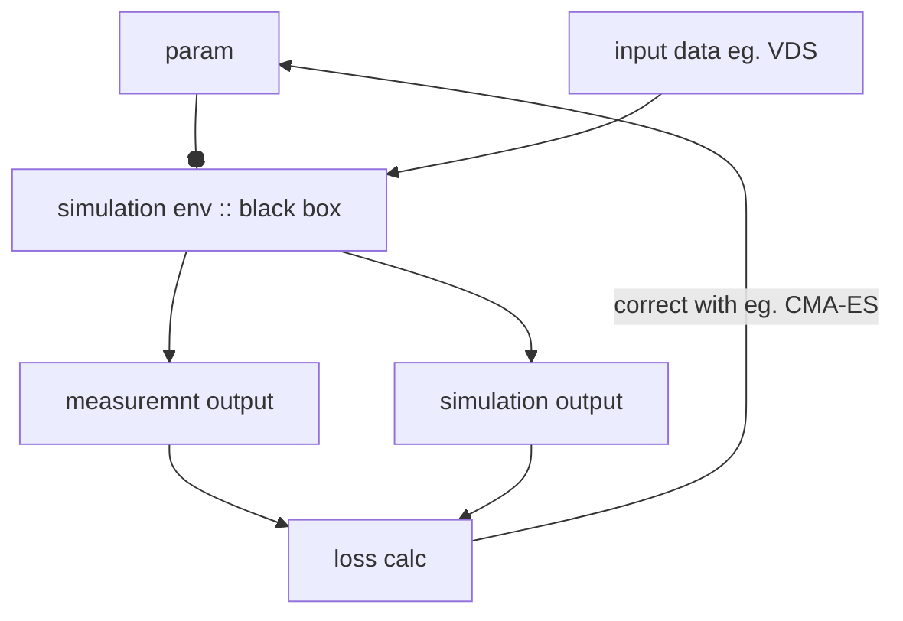
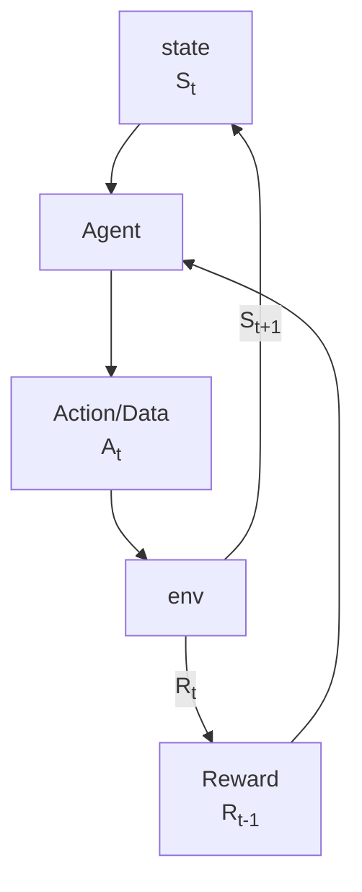
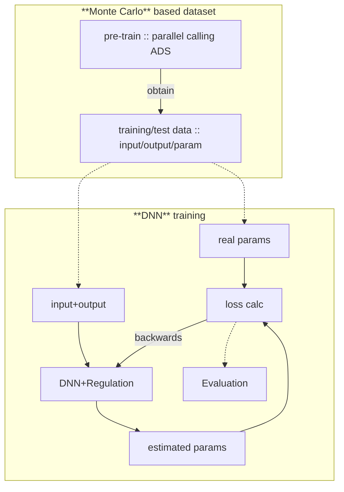
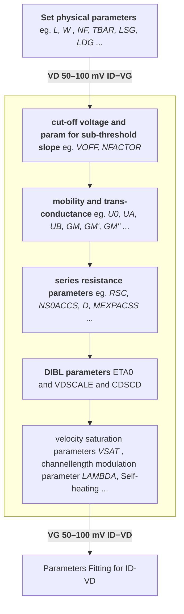
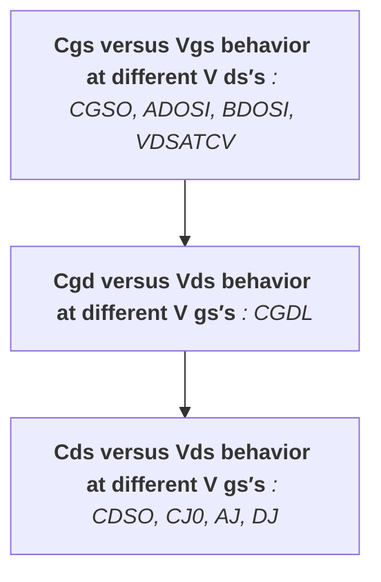

# Proposal - Parameter Extraction of GaN ASM-HEMT Model
---

## Comparision of different methods

In this case, because the simulation env doesn't support any differential operation for backwards propagation, so the simulation env should be regarded as a black box.

Some basic ideas therefore to extract and optimize parameters from a black box physical/virtual system:

> 1. **Online training with evolutionary algorithm**:

>> Easy work flow to achieve with not too much initial training data, but evolutionary algorith doesn't rely on serious gradient descent (even not differential available here), easy to be trapped into a local minimal and sometime not really reliable. On the other hand, in most cases doesn't support parallel working, very slow during searching and training.

> 2. **RL**(reinforcement learning):

>> Adaptive and doesn't need the sys is differential available. However maybe need a lot computational resource during parallel calc.

> 3. **DNN** (deeplearning based) with large amounts of traninig data:
> 

>> Some papers have already proved, even a DNN training need a large amount of traning/test data, with gradient descent it can really get some good regression.


When choose DNN as the way for parameter extraction, the following steps should be followed for implementation:

1. with **Monte-Carlo** iteration, generate large amount dataset, consisting of parameters, inputs and outpus eg. $I-V$ and $C-V$ data.
2. deplot a DNN with $I-V$ and $C-V$ realation or their feature as input, paramters as output. Use SGD to converge.
3. Use regulation methods and fine-turning of hyper-parameters to ensure generalization and avoid overfitting.
4. evaluate model and use measured data as input to estimate the real parameters in practical devices.

> **The challenging part is**, most papers only do the $I-V$ parameter's estimation, but not about $C-V$ character.

---
##  Relevant Variables for Parameter Extraction

### I-V Parameter Extraction

Standard work flow recommended by reference paper:


**Seems the critical params in ID-VD is the same as in ID-VG.**

Some parameters in this process are used however not used in other papaers, a comparision table is listed below:

<table>
  <tr style="background-color: #f2f2f2;">
    <th><strong>used Parameters in recommended process - S1</strong></th>
    <th><strong>used Parameters in DL based paper - S2</strong></th>
  </tr>
  <tr>
    <td>VOFF, NFACTOR, U0, UA, UB, GM, GM', GM'', RSC, NS0ACCS, D, MEXPACSS, ETA0, VDSCALE, CDSCD, VSAT, LAMBDA ... </td>
    <td>VOFF0, U0, NS0ACCS, NFACTOR, ETA0, VSAT, VDSCALE, CDSCD, LAMBDA, MEXPACCS + I-V Dataset</td>
  </tr>
</table>

Clearly, $S_2 \in S_1$.


### C-V Parameter Extraction

C-V Character is actucally the relation of $C_{GS}, C_{GD}, C_{SD}$ versus $V_{DS}$ with following euqation:

$$
\begin{cases}
C_{OSS} =& C_{GD} + C_{SD} \\
C_{ISS} =& C_{GD} + C_{GS} \\
C_{RSS} =& C_{GD} \\
\end{cases}
$$

Normally use $C_{OSS}, C_{ISS}, C_{RSS}$ to represent the $C-V$ characteristic.

The work flow can be represented as following figure:


---
## DL based Parameter Extraction for I-V Character

Normally there is 2 options for this step:
- $I_{DS} - V_{GS}$ with different $V_{DS}$
- $I_{DS} - V_{DS}$ with different $V_{GS}$

In terms of parameter extration, both options are equivalent. According to the given procedure, each of them can be used seperately to extract the prameter combinations, or implemented together for fine-turn.

If $I_{DS} - V_{GS}$ is chosen, the figrue is showed below:

<p align = "center">    

</p>   

It's obvious here that it contains 2 modes, when $V_{DS} > 0$, it firstly get into linear region, then get into saturation region, the whole curve is non-linear; When $V_{DS} < 0$ the current flows through 3rd Quadrant and it works like linear resistor load. These 2 seperate feature make the net harder to learn its property.

On the other hand, the measurement data contains also not enough data in terms of $V_{GS}$ (only 7 data in fact with $V_{GS} \in \{1,2,3,4,5,6,7\}$), which makes each curve not accurate.

If $I_{DS} - V_{DS}$ is chosen, the figrue is showed below:

<p align = "center">    

</p>   

No multiple modes according to different $V_{GS}$, should be a clearer mode to learn. On the other hand, the amount of data in terms of $V_{DS}$ is enough. So $I_{DS} - V_{DS}$ relation would be chosen as one of the learning goal.

For training based on DNN, both are used to build a suitable structure of the input dataset. But $I_{DS} - V_{DS}$ curve is chosen as a matrix with $V_{GS}$ as row and $V_{DS}$ as column, each element in this matrix corresponds to $I_{DS}$, while the other curve $I_{DS} - V_{GS}$ is transformed as a matrix of $g_m$. The definition of transconductance $g_m$:

$$
g_m = \frac{\partial I_{DS}}{\partial V_{GS}} |_{V_{DS} = const.}
$$

Acctually the range of the figure of $I_{DS}-V_{DS}$ illustated above is not suitable, at least in this implementation. Because the measured date from prctical device contains the influence coming from the cooling component, namely thermal factor. This causes the **self-fitting** effect, which finally leads to the current decreasement after it reached to the peak at the saturation region.

However, in simulation this effect is disabled in 1st process's expriment, which leads to finally a unconsistence between simulation and measurement and a higher loss. In order to avoid this problem, a narrower range of $V_{DS}$ would be accepted here as $[-3.5V, 8.5V]$, with step size of $0.1V$. So the shape of $I-V$ matrix is $\mathbb{R}^{7 \times 121}$. 

On the other hand, since here the $g_m$ is calculated using interpolation of two adjacent $V_{GS}$ point, so the number of row of $g_m$ is 1 less.

Interpolation would be used here to reduce the number of row of $I-V$ by 1. The available value for $V_{GS}$ is changed from $\{1,2,3,4,5,6,7\}$ into $\{1.5,2.5,3.5,4.5,5.5,6.5\}$.


The final form of the input is showed in following figure:
<p align = "center">    

</p> 

However the number of rows is a little bit too small comparing with the reference, I keep doubting whether the performance of the net would be influenced by this.

### Dataset Generation from Multi-processing ADS

Both `ASM-HEMT` model and `HEMT verilog-a` model provide a lot of available parameters, even more than 100, just for I-V characters. However many of them are relevant or coupling. It means if all parameters are implemented for the regression of `I-V` character, on the one hand, the solution space would be too large to be searched, on the other hand, there may be many feasible solutions, but non-unique. 

Such conclusion could make the training process even harder, beacuse the number of local minimal is quiet so large.

The paper `Deep Learning-Based ASM-HEMT I-V  Parameter Extraction` provides a solution that only 10 parameters are available for the regression, keep others default value. The performance of this method will also be validated in following expriment.

First of all is to get the training dataset, the process is showed below:

<p align = "center">    

</p> 

In the final exported training dataset, for each single set, the dimension of input matrix $X$ and output vector (labels) $Y$ is:

$$
X \in \mathbb{R}^{7 \times 236 \times 2}, \; Y \in \mathbb{R}^{10\times 1}
$$

In terms of code under `Python`, it is noteworthy that all codes must be runned in a `Jupyter` Notebook under the ADS integrated `IPython` env. The use of alternative Python environments, the initiation of subthreads, or the direct execution of code in a `.py` file are all not permitted by ADS API.

The available code supporting this fuctionality can be found in `data_gen.ipynb`. A powerful function `singel_process_iteration_data_gen2h5` with interface providing a rich set of customizable parameters
is defined to realize the data generation within a single process, generated data will be saved as `.h5` data form.


### Data Pre-Processing

The section of data pre-processing has several steps:
1. format transformation: from `.h5` to `numpy`/`torch`;
2. noise addition: build $I_{D}^{noisy}$, make simulated results more realistic;
3. recalculate $g_m^{noisy}$, to match new $I_{D}^{noisy}-V_G$ data;
4. normolize output parameters/labels, eliminate the large disparities in dimensional scales among parameters.

In terms of noise addition, the modified expression of $I_{D}^{noisy}$ is:

$$
I_D^{noisy} = (1 + \epsilon_{gain})I_D + \mathcal{N}(0,(\alpha|I_D| + \beta)^2) + \epsilon_{lf} + \epsilon_{thermal}|_{|I_D|}
$$

where the $\epsilon_{gain}$ corresponds to the gain error, $\alpha$ to relative noise compared with measured current, $\beta$ to background white noise, $epsilon_{lf}$ and $\epsilon_{thermal}$ here respectively to the low frequency $1/f$ noise and thermal shift (self-fitting), but because the ADC and component keep working in high frequency and self-fitting is already eliminated by forwards shiftted high side of $I_{DS}$'s range, so the last 2 items can be neglected here.

Firstly the way to get $\epsilon_{gain}$ is to align the smoothed curve to the measured values using least squares scaling:

$$
g^* = \operatorname*{argmin}_g  \sum_{i}(E(I^{meas} - gI^{smooth}))^2 
$$

Simplify this expression with:

$$
\sum_{i}(E(I^{meas} - gI^{smooth}))^2 &= \sum_{i}(E(I^{meas}) - E(gI^{smooth}))^2 \nonumber \\
~&= \sum_{i}(E(I_D^{noisy}) - E(gI_D^{smooth}))^2 \nonumber \\
~&= \sum_{i}((1 + \epsilon_{gain})I_D - gI_D)^2 \nonumber \\
~&= \sum_{i}((1 + \epsilon_{gain} - g)I_D)^2
$$

Easy to get $g^*$ with:
$$
g = \frac{\sum_{i}I_i \hat{I_i}}{\sum_{i}\hat{I_i^2}}
$$


Then can get $\epsilon_{gain}$ with:

$$
\epsilon_{gain} = g^* - 1
$$

Next, to determine the variance of the Gaussian distribution modeling the relative error, use same smoothing methode to get $I_D^{smooth}$ or $\hat{I_D}$, do following steps:
1. calculate residual error:
   
$$
\underline{r}|_{V_{GS}} =  \underline{I_D}^{noisy} - \hat{\underline{I_D}}  
$$

2. with different groups of $V_{GS,i}$ , $\ \ \underline{r}|_{V_{GS}} \to \underline{\underline{R}}$,  use it to calculate $std(\underline{r})$, then use least squares scaling once again for weight $\alpha$ and bias $\beta$:

$$
\alpha, \beta^* = \operatorname*{argmin}_{\alpha, \beta} \sum_{i}(std(r_i) - (\alpha|I_{D,i}| + \beta))^2 
$$

At the extremum point:

$$
\left\{
  \begin{aligned}
    \alpha & =  \frac{\sum_{i}^{n}(std(r_i)-\beta)|I_{D,i}|}{\sum_{i}I_{D,i}^2} \\
    \beta & = -\frac{\sum_{i}^{n}(std(r_i)-\alpha|I_{D,i}|)}{n} \\
  \end{aligned}
\right.
$$

> \* $x, \underline{x}, \underline{\underline{X}}$ corresponds here respectively value, vector and martix.

Based on measured data and the theory discussed above, the estimated values of the parameters are:

$$
\left\{
  \begin{aligned}
    \epsilon_{gain} & = 9.4e-6\\
    \alpha & =  -3.8e-3 \\
    \beta & = 4e-2 \\
  \end{aligned}
\right.
$$

### Model Training (basic structure based on version 1.0)

For the first version of model training, just simplify this task based on some general training ideas:

> **Network structure:**
> 1. use gerneral `DNN` to train the model;
> 2. use both $I_{DS}-V_{DS}$ and $g_m$ as input, with the shape of $2 \times 6 \times 121$;
> 3. flatten input tensor as a vector to feed into the current neural network;
> 4. use only referenced and recommended 11 parameters as output.
> 5. all data is based on `.h5` format, current training dataset is with $X \in \mathbb{R}^{10000 \times 2 \times 6 \times 121}$ and $Y \in \mathbb{R}^{10000 \times 11 \times 1}$, consisting of the rows corresponding $V_{GS} \in [1.5,6.5]$ of step 1, the columns corresponding $V_{DS} \in [-3.5,8.5]$ of step 0.1, each element corresponding $I_{DS}$ under the specified voltage condition in that position.


> **Training methods:**
> 1. Pre-procsssing to those $Y$ with `Log-Transformation` who has large range based on following criterium (self adaptive to the range and unit):
$$
\left\{
  \begin{aligned}
    y & \in [y_L, y_H]\\
    y_L & \geq 0 \\
    \frac{y_H}{y_L} & \geq 50 \\
  \end{aligned}
\right.
$$
> 2. support pre-define a hyper-parameter space to achieve optimization of hyper-parameters (random search, multiple trainings working parallelly);
> 3. Optimizer: 
> - - `Adam`() + `Weight decay`: for generalization, reduce the norm distance between $\|Y\|$ and $\|\underline{\underline{0}}\|$;
> - - `Dropout`: also for for generalization;
> - - `OneCycleLR`: adaptive adjustment of learning rate, first big then samll for better converge;
> - - `AMP`: Automatic Mixed Precision of `float32` and `float 64`, fater training;
> - - `Early stopping`: use a paramter called `patience`, if no improvement after the number of `patience`, early stop;
> - - `BatchNorm`: for faster training, nomlize intermedium result.


> **Existing Problems:**
> 1. overfitting to simulation generated data, good performance in train/val/test set, bad in meas data;
> 2. I-V result of param conibation not unique;
> 3. row number from 7 to 6, but use interplot;methode, seems not reliable becasue I-V property is non-linear, eg. $I-V$ curve of $V_{GS} = 1.5$ not stay exactly on the middel of curve of $V_{GS} = 1$ and curve of $V_{GS} = 2$;
> 4. might need more trainingset;


### Model Version Log

**version 1.x**: 
- input/output structure: $X \in \mathbb{R}^{10000 \times 2 \times 6 \times 121}$ with both $I-V$ and $g_m$, row minus 1 from 7 to 6 and $Y \in \mathbb{R}^{10000 \times 11 \times 1}$;
- train/val/test: 70/15/15

- **version 1.0**
- - hidden network structure: (1536,768,384,192)
- - total training epochs: 180
- - train/val/test loss: 3.989/4.345/4.338
- - meas data average MAE = 15.183

**version 2.x**:
- only $I-V$ as input with not 6 but 7 rows, ignore $g_m$;
- multihead mechanism: 11 output parameters are seperately outputed, with pure linear head component $Linear(... \to 1)$;
- apply DTP(Dynamic task prioritization for multitask learning), dynammic plan the importance of 11 different tasks;
- add output range boundary, but doesn't influence backwards propaganda;
- interface for more noise, for better generalisation
- **version 2.0**
- - hidden network structure: (1024,512,256,128)
- - total training epochs: 180/180
- - train/val/test loss: 3.8937/3.1894/3,1226
- - meas data average MAE = 6.370
- **version 2.1** <font color= #5197ffff>: same param but bigger epoch</font>
- - hidden network structure: (1024,512,256,128)
- - total training epochs: 300/300
- - train/val/test loss: 3.6373/2.8837/2.8833
- - meas data average MAE = 9.099
- **version 2.2** <font color= #5197ffff>: try improve generalisation only with higer regulation</font>
- - hidden network structure: (1024,512,256,128)
- - total training epochs: 200/200
- - drop out: 0.1 -> 0.25 
- - lr: 1e-3 -> 9e-4
- - patience: 20 -> 10
- - weight-decay: 1e-4 -> 6e-4
- - train/val/test loss: 4.522/3.6358/3.5942
- - meas data average MAE = 4.881
- **version 2.3** <font color= #5197ffff>: try improve generalisation only with smaller memory</font>
- - hidden network structure: (896,448,256,128)
- - total training epochs: 60/180
- - patience: 20 -> 10
- - lr: 1e-3 -> 9e-4
- - batch-size: 256 -> 128
- - train/val/test loss: 4.872/4.6545/4.4341
- - meas data average MAE = 4.505
- **version 2.4** <font color= #5197ffff>: combine v2.2 and v2.3</font>
- - hidden network structure: (896,448,256,128)
- - total training epochs: 200/200
- - drop out: 0.1 -> 0.25 
- - patience: 20d
- - lr: 1e-3 -> 9e-4
- - weight-decay: 1e-4 -> 6e-4
- - aug-noise-std: 0.015
- - aug-prob: 0.5
- - batch-size: 256 -> 128
- - train/val/test loss: 4.5914/3.6551/3.6299
- - meas data average MAE = 2.074

**version 3.x:**
- based on best case in version 2.x, namely the v2.4, try `ensemble model` based on 3 different modes: robust model/middle model/expended model.
- **version 3.1** <font color= #5197ffff>: robust model</font>
- - hidden network structure: (768,384,192,128)
- - total training epochs: 173/180
- - drop out: 0.25 
- - patience: 10
- - lr: 8e-4
- - weight-decay: 6e-4
- - batch-size: 128
- - aug-noise-std: 0.015
- - aug-prob: 0.5
- - train/val/test loss: 4.7104/3.831/3.7949
- - meas data average MAE = 3.336
- **version 3.2** <font color= #5197ffff>: middle model</font>
- - hidden network structure: (960,512,256,128)
- - total training epochs: 178/180
- - drop out: 0.25 
- - patience: 10
- - lr: 8e-4
- - weight-decay: 6e-4
- - batch-size: 128
- - aug-noise-std: 0.015
- - aug-prob: 0.5
- - train/val/test loss: 4.6218/3.7727/3.6974
- - meas data average MAE = 2.853
- **version 3.3** <font color= #5197ffff>: expended model</font>
- - hidden network structure: (1024,512,256,128)
- - total training epochs: 163/180
- - drop out: 0.25 
- - patience: 10
- - lr: 8e-4
- - weight-decay: 6e-4
- - batch-size: 128
- - aug-noise-std: 0.015
- - aug-prob: 0.5
- - train/val/test loss: 4.601/3.7961/3.7123
- - meas data average MAE = 2.346

**version 4.x**:
- further improvement based on the results of version 2.x and version 3.x -> regard v2.4 as baseline, try small step's changing.
- try ensemble model again but with same network structure.
- **version 4.1** <font color= #5197ffff>: slight stronger perturbation</font>
- - hidden network structure: (896,448,256,128)
- - total training epochs: 129/180
- - drop out: 0.25 
- - patience: 10
- - lr: 9e-4
- - weight-decay: 6e-4
- - aug-noise-std: 0.02
- - aug-prob: 0.8
- - batch-size: 128
- - train/val/test loss: 4.7834/4.0889/4.0132
- - meas data average MAE = 4.684
- **version 4.2** <font color= #5197ffff>: robuster, even stronger perturbation and regulation, lower learning rate</font>
- - hidden network structure: (896,448,256,128)
- - total training epochs: 96/180
- - drop out: 0.3
- - patience: 8
- - lr: 7e-4
- - weight-decay: 8e-4
- - aug-noise-std: 0.03
- - aug-prob: 0.9
- - batch-size: 128
- - train/val/test loss: 5.3817/4.8097/4.6865
- - meas data average MAE = 2.433
- **version 4.3** <font color= #5197ffff>:fixed lr, stronger regualtion</font>
- - hidden network structure: (896,448,256,128)
- - total training epochs: 66/150
- - drop out: 0.3
- - patience: 8
- - no-onecycle
- - lr: 5e-4
- - weight-decay: 1e-3
- - aug-noise-std: 0.03
- - aug-prob: 0.9
- - batch-size: 96
- - train/val/test loss: 5.527/4.8829/4.7468
- - meas data average MAE = 2.894
- **version 4.x.1** <font color= #5197ffff>:ensemble model</font>
- - ensemble model of v4.1 - v4.3
- - slight stronger perturbation + stronger perturbation and regulation + strongest regualtion / fixed lr
- - meas data average MAE = 2.395
- **version 4.4 - version 4.8** <font color= #5197ffff>:same as v2.4</font>
- - totally the same as version 2.4 but with different seed
- - train/val/test loss respectively //, //, //, //
- - MAE respectively =  0, 0, 0, 0
- **version 4.x.2** <font color= #5197ffff>:ensemble model</font>
- - ensemble model of v4.4 - v4.8
- - meas data average MAE = 2.13

**version 5.x** <font color= #5197ffff>:different seeds trails</font>
- try previous good versions with different seeds
- **version 5.1.x**
- - totally 5 seeds based on version 2.4
- - seeds from 42 to 46
- - MAE = 4.074, 2.91, 4.193, 4.019, 2.444
- **version 5.2.x**
- - totally 5 seeds based on version 2.4
- - lower patience = 13
- - less max epcochs = 180
- - seeds from 42 to 46
- - MAE = 2.639, 5.197, <font color= #ff0000ff>1.937</font>, 2.139, 5.632
- **version 5.3.x**
- - totally 5 seeds based on version 3.3 with expanded network
- - seeds from 42 to 46
- - MAE = 2.346, 6.731, 4.855, 10.244, 3.349
  
**version 6.x** <font color= #5197ffff>:bigger training dataset of 100e3 samples (before outlier removel)</font>
- applied outlier removel
- bigger training dataset
- **version 6.1**
- - model still based on version 2.4
- - MAE = 10.961 -> terrible but better prediction for previous small training dataset, which is not used for training!


<table>
  <tr style="background-color: #f2f2f2;">
    <th><strong>Parameter</strong></th>
    <th><strong>version-1.x</strong></th>
    <th><strong>version-2.0</strong></th>
    <th><strong>version-2.1</strong></th>
    <th><strong>version-2.2</strong></th>
    <th><strong>version-2.3</strong></th>
    <th><strong>version-2.4</strong></th>
    <th><strong>version-3.1</strong></th>
    <th><strong>version-3.2</strong></th>
    <th><strong>version-3.3</strong></th>
    <th><strong>version-3.x ensemble</strong></th>
    <th><strong>version-4.1</strong></th>
    <th><strong>version-4.2</strong></th>
    <th><strong>version-4.3</strong></th>
    <th><strong>version-4.x.1 ensemble</strong></th>
    <th><strong>version-4.x.2 ensemble</strong></th>
    <th><strong>version-5.x</strong></th>
  </tr>

  </tr>
    </tr>
    </tr>
    </tr>
    </tr>
    <tr>
    <td>meas data <br> MAE</td>
    <td>15.183</td>
    <td>6.370</td>
    <td>9.099</td>
    <td>4.881</td>
    <td>4.505</td>
    <td>2.074</td>
    <td>3.336</td>
    <td>2.853</td>
    <td>2.346</td>
    <td>2.494</td>
    <td>4.684</td>
    <td>2.433</td>
    <td>2.894</td>
    <td>2.395</td>
    <td>2.13</td>
    <td>1.937</td>
  </tr>
</table>

<font color= #ff00007c> \*Best case till now: version 2.4 with MAE = 2.074 </font>

---
### Difficulties of current model's preformance

Till now, even for the best case of version 2.4, the lowest MAE can only be reduced to around 2.07, still a large space to be further improved (in theory). And the I-V prediction curve also seems not so good, with an unusual spike similar to an overshoot always appear around 6.5V. Because the network structure, not only the hyper-parameters but also the input dataset structure already be modified and improved for multiple versions, one intuitive conclusion is: **something is wrong with the training dataset -> the feature of meas data rarely appears in training dataset**. 

Only this could even explain, why this problem always happens, making the final result not so satisfied, even weired.

Several possibilities might be helpful for such problem:

1. still based on current ASM-HEMT parameter range, however generate much more data, at least 10 times bigger than current dataset, to create more samples with similar feature as meas data.
> This must be the easiest way to do, however the amount of this feature is still small, might not helpful.

2. label the generated samples in training dataset manually, using these to train an additional DNN for dual-classification: practical I-V or inpossible I-V. This would be helpful for determining a narrower ASM-HEMT parameter range for further better data generation ,also can use chosen reliable training data to train the DNN once again.
> This method could be hard (tired) but sound the most reliable one based on current config.

3. too much chosen parameters in output Y for the DC character (even only 11 here), leading to a too huge solution space, the practical parameter range only takes a very small amount of this huge solution space, making the current prediction very easy to stay far from desired region of solution region.
> reasonable but hard to find a better parameter set now.

4. the current used range of $V_{DS}$ is still too small, doesn't contain the staturation region, where the $I_{DS}$ converge to a steady state, this would also influence the prediction.
> reasonable and easy to correct, do another group of data generation.

In the following sections some of the methods discussed above would be implemented for better performance of parameter estimation.

---
## Model Improvement :: bigger training dataset

In this section, the size of training dataset will be expanded from 10e3 samples to 100e3 - 120e3 samples according to the reference *Deep Learning-Based ASM-HEMT I-V  Parameter Extraction* with data pre-processing (**additional noise** based on measurement data and **Outlier removal**). 

However, the MAE performance of meas data for this is worse than before with samller training dataset. accoring to result of version 6.1, the MAE even risen up to around 10. But on the other hand, its performance towards the previous smaller dataset of 10e3 samples, which is not applied here during training, is better than previous any models.

A most likely reasion is, it indeed better learned the feature of the training dataset (doesn't mean overfitting, at least not clear compared between train/val/test loss), but the data distribution of sim-data doesn't match the distribution of meas-data, namely so called **Distribution Shift**.

This could be a very likely entry point，used to predict practical device parameters with training data in sim-distribution -> becasue the real parameter range against the undertested device is unknow.

---
## Model Improvement :: modified parameter generator- with log-uniform distribution

A data viewer is built for observation of generated data, a interesting phenomenon is here luckily captured. For example for the parameter VDSCALE, which locates in range of $[0.5, 1e6]$, if a linear uniform distribution is applied to generate random data for this parameter, most of the data would locate in the sub range of $[1e4,1e6]$, because $\frac{1e6-1e4}{1e6-0.5} \approx 99\%$, it means, if the realistic effective solution space locates in a small range at aroudn 1e+0 to 1e+3, they would almost never be searched and contained in the generted parameter set. This leads to a huge problem, the training dataset connot display $P(x)$ as much as possible, so the model also cannot do a good prediction facing an unknow $x$ when the input is measurement data. 

A mixed strategy is applied here, trying to solve this issue:
1. for parameters with big given range (≥ 3 orders of magnitude), applied 70% global log-uniform (each magnitude has similar number of samples) + 30% beta bias (pay more attention at low side with small magnitude)
2. for parameters with small given range. appliled 100% global log-uniform distribution.
3. for parameters with range containing zero or negative value, applied `log1p` methode to avoid bugs, since the input domain of log is $(0,+\infin)$.

Another training dataset of 10e3 samples based on this log-param-generator is tested with model version 2.4.

The effect of this improvement is delightful, obviously in the result of the reference, the model has better learned the pattern of the meas-data: 
1. the overshoot (abnormal convex point) locating in inference's output disappears, the model get much closer to the represented pattern in the meas-data.
2. distance of each $I_{DS}$ curve under different $V_{GS}$ get more uniformly, and also very close to the situation in meas-data.
  
However, still some shortcomings yet:
high MAE (best case around 7) and relative big distance facing the peak value (the last value in each $I_{DS}$ curve). 

In this case considering using a bigger dataset based on log-uniform data generator for better performance.


---
## Model Improvement :: 2 stage training - better covergeence with inverse ASM-HEMT forward proxy $g$

Several reasions constrain the performance of previous model:
1. basically the process $X \to \hat{Y}$, namely from $I-V$ curve to parameters, is a question with multiple solutions, which greatly restricts the performance of model in this direction;
2. data distribution in meas data not the same with that in training data.

One methode could be helpful for such situation: train a proxy net $g$ on duty for process $Y \to \hat{X}$, which supports differential operation, freeze the parameters and apply it in loss calculation. The advantages of it are:
1. $Y \to \hat{Y}$ is a single-solution problem, with shallower network depth and better convergence;
2. could be a powerful constrain/penalty item for better covergence towards expected distribution

In this case, the loss function can be updated with new items:
$$
\begin{align}
\mathcal{L}_{total} &=  \mathcal{L}_{sup} + \lambda_{sim}\Vert X_{sim}-\hat{X}_{sim}\Vert  + \lambda_{meas}\Vert X_{meas}-\hat{X}_{meas}\Vert  \nonumber \\
~&=  \mathcal{L}_{sup} + \lambda_{sim}\Vert X_{sim}-g(f(X_{sim}))\Vert  + \lambda_{meas}\Vert X_{meas}-g(f(X_{meas}))\Vert  
\end{align}
$$

Here the $f(\cdot)$ and $g(\cdot)$ corresponds respectively the backward main model and the weight freezen forward proxy model $g$.

Some necessary reference values to varify the performance of training:
- for proxy model $g$, a acceptable test val should be at least smaller than 0.018;
- for main model, the NMAE(avg) better below 3% - 4%.

Code files in this improvement locate in `runs_2stage`.

**version 1.x**
- No second-stage fine-tuning, training with double log trainingset, validating MAE with meas data
- hidden (960,512,256,128)
- batch-size 512, lr 1e-3 with adaptive onecycle lr
- dropout 0.2, weight-decay 3e-4, max-epochs 120, patience 12
- lambda-cyc-sim 0.1, lambda-cyc-meas 0.1, cyc-warmup-epochs 15
- proxy-hidden (512,384,256), proxy-lr 5e-4
- **version 1.1**
- - default config
- - MAE = 2.01
- **version 1.2**
- - fixed lr 8e-4, without onecycle
- - MAE = 2.463
- **version 1.3**
- - with adaptive onecycle, default lr, max epochs 150
- - MAE = 3.878
- **version 1.4**
- - same default config as version 1.1
- - higher lambda-cyc-meas = 0.2
- - MAE = 2.459
- **version 1.5**
- - same default config as version 1.1
- - smaller lambda-cyc-meas = 0.05
- - MAE = 3.6
  
**version 2.x**
- with second stage fine tuning
- pre trained proxy g with full plus meas-like dataset, 1st-stage trained in full dataset, 2nd-stage fine turned in meas-like dataset
- proxy structure: 
```bash
python asm_hemt_2stage_dnn.py --data "E:/personal_Data/Document of School/Uni Stuttgart/Masterarbeit/Code/param_regression/ADS_Parameter_Fitting/IV_param_regression/NN_training/dataset/training/stage_1_fpml_data.h5" ^
  --train-proxy-only  --outdir runs_test/temp_check --proxy-hidden 512,384,256 --proxy-lr 1.33e-4 --proxy-wd 6e-5
```
- main structure (1st-stage training): 
```bash
python asm_hemt_2stage_dnn.py --data dataset/training/stage_1_full_data.h5 ^
  --hidden 960,512,256,128 --batch-size 512 --lr 1e-3 ^
  --dropout 0.2 --weight-decay 3e-4 --max-epochs 120 --onecycle-epochs 120 --patience 12 ^
  --meas-h5 dataset/training/meas_data.h5 ^
  --lambda-cyc-sim 0.1 --lambda-cyc-meas 0.1 --cyc-warmup-epochs 15 ^
  --outdir runs_test --proxy-run runs_test/temp_check/best_g_fpml
```
- fine turning params:
- - full net turning: 
```bash
  python asm_hemt_2stage_dnn.py --data dataset/training/stage_2_ml_data.h5 ^
  --finetune-from runs_test/temp_check/ft_before --ft-use-prev-transforms ^
  --lr 1e-3 --dropout 0.2 --weight-decay 1e-5 --max-epochs 120 --onecycle-epochs 120 --patience 12 ^
  --meas-h5 dataset/training/meas_data.h5 ^
  --lambda-cyc-sim 0.1 --lambda-cyc-meas 0.1 --cyc-warmup-epochs 15 ^
  --outdir runs_test --proxy-run runs_test/temp_check/best_g_fpml
```

- - only output heads turning (frezzen trunk): 
```bash
python asm_hemt_2stage_dnn.py --data dataset/training/stage_2_ml_data.h5 ^
  --finetune-from runs_test/temp_check/fine_turn_before --ft-use-prev-transforms --ft-freeze-trunk ^
  --lr 8e-4 --dropout 0.2 --weight-decay 1e-4 --max-epochs 60 --onecycle-epochs 60 --patience 10 ^
  --meas-h5 dataset/training/meas_data.h5 ^
  --lambda-cyc-sim 0.1 --lambda-cyc-meas 0.1 --cyc-warmup-epochs 15 ^
  --outdir runs_test --proxy-run runs_test/temp_check/best_g_fpml
```

- **version 2.1**
- default config (full net turning) describing above

**version 3.x and version 4.x**
- adjustment for better hyperparameters... but not so good.

---
## Reconsideration about current model and our goal

After trying using some resonable improvements, paper searching and hyper-parameters adjusting, even the inference's result is not much improved, but the current problem of this topic becomes much more clear.

The essence of the problem is that, this is **a problem with non-unique solutions**. For a problem with unique solution, namely the one-to-one mapping, Deep Learning could be a powerful tool to find out the approximate formula behind. However, in this case, things become different.

The question can be abstracted into another form especially in our case: how to estimate a 2 dimensional Mixture Gaussian Distribution, given the probability z and output x, y, even although not each single gaussian distribution is recorded in the traning dataset.

There are generally 3 methods facing this challenge:
1. try to get a solve equations which contains all possible solution, which describes the whole solution space :: however, this seems to be impossible for deep learning method, mostly applied in **analytical solution**.
2. use **Evolutionary Algorithms**, search for one feasible solution.
3. assuming that the training dataset contains at least one feasible distribution of the goal, choose one result from these many feasible distributions.

The first method is absolutely not suitable for this topic, and the second one, which is appied before, also with poor performance and unbearably long searching time. And for the third methode with pure deep learning method, inference's result could be very bad because the model would try merging the results from different distribution, leading to, multiple good results become one bad result.

The way to improve the output of the deep learning method is to add more constrains, either with some prior knowledge building some exquisite structure or with some reverse proxy model of one-one-mapping (relatively much much easier to learn) or... All in all, **add more powerful constrains**.

The way "inverse ASM-HEMT proxy net G" written above, also belongs to one type of such constrains. It cares less about the $loss_{X\to Y}$, pay more attention on $loss_{X\to \hat{Y}\to \hat{X}}$, use a one-one-mapping forward proxy model to pull the result closer to one feasible region rather than the mixture of all feasible region, which normally corresponds to a bad solution.

Hence currently, **3 possibly effetive methods** are considered to be applied for this topic:
1. **add more powerful constrains** in current model structure containing an additional forward proxy model $g$;
2. **DNN + evolutionary algorithmus**, use DNN to find a not good result working however as a good start point for the evolutionary algorithmus's searching;
3. **more advanced network type or structure**, like PINN or a two braches network: one branch provides N different kerns for N independent $\hat{Y}$ (for N different distributions), the other takes responserbility for N possibilities, with constrains to promote one possibility much higher than others, then calculate the average of their products, still $loss_{X\to \hat{Y}}$.


---
## Model Improvement :: 2 stage training - better covergeence with inverse ASM-HEMT forward proxy $g$ - 2nd version `further optimized`

According to the disscussion `reconsideration` written above, due to the multiple solution of current goal question, a loss calculation based on $\mathcal{L}(Y,\hat{Y})$ could be useless, which easily leads to a corruption of prediction from several different distribution and causes a bad result. And this view is also verified by previous training's result, for both bad covergence, bad NMAE/MAE and bad pattern towards the meas-data.

In this case, a further optimization would be applied, in order to improve the prediction and too high training/val/test loss.

The first thing to do is to add an additional coefficient $\alpha$ before $\mathcal{L}$ to greatly decrease the weight of it, even close or equal to zero, because this $\mathcal{L}(Y,\hat{Y})$ is useless in this case and even have some negative effects for the final goal.

$$
\begin{align}
\mathcal{L}_{total} &= \alpha \mathcal{L}_{sup} + \lambda_{sim}\Vert X_{sim}-\hat{X}_{sim}\Vert  + \lambda_{meas}\Vert X_{meas}-\hat{X}_{meas}\Vert  \nonumber \\
~&= \alpha \mathcal{L}_{sup} + \lambda_{sim}\Vert X_{sim}-g(f(X_{sim}))\Vert  + \lambda_{meas}\Vert X_{meas}-g(f(X_{meas}))\Vert  
\end{align}
$$

Currently, except $\mathcal{L}_{sup}$ the rest of loss functions are calculated using a L2 Norm, which is available to further optimized later.

Besides, replace the previous target of early stopping and val/test with current loss calculation method.

The target values of optimization (early stopping) in this part are:
- for proxy model $g$:
- - good: `val` <= 0.02
- - so so: 0.02 ~ 0.05
- - bad: > 0.05
- for main model $f$:
- - good: `val_cyc_sim` <= 0.9
- - so so: 0.9 ~ 1.1
- - kindy too high: > 1.3


Code files in this improvement locate in `runs_2stage_2nd_version`.


Training result:
- proxy model in `runs_2stage_2nd_version/proxy_g`
- - training with `stage_1_fpml_data.h5`
- - `bets val` = 0.0297, `epochs` = 200/200, `used patience` = 4/25
```bash
python asm_hemt_2stage_dnn.py --data dataset/training/stage_1_fpml_data.h5 ^
  --train-proxy-only  --outdir model/runs_2stage_2nd_version/proxy_g --proxy-hidden 512,512,512,512 --proxy-batch-size 2048^
  --proxy-lr 2.0e-4 --proxy-wd 5e-5 --proxy-patience 25 --proxy-epochs 200 --proxy-seed 3943386831
```

- main model of stage-1 in `runs_2stage_2nd_version/stage_1`
- - `val_cyc_sim` =  0.072325, `cyc_meas` = 0.170688, `prior_l2` = 1.011297e+00, `prior_bnd` = 6.516047e+29, `best val` = 0.071984, `used patience` =  14/15
- - MAE of meas data: 2.151
- - NAME of meas data: 15

```bash
python asm_hemt_2stage_dnn.py --data dataset/training/stage_1_full_data.h5 ^
  --hidden 960,512,256,128 --batch-size 512 --lr 3e-4 ^
  --dropout 0.2 --weight-decay 3e-4 --max-epochs 150 --onecycle-epochs 120 --patience 15 ^
  --meas-h5 dataset/training/meas_data.h5 ^
  --lambda-cyc-sim 0.3 --lambda-cyc-meas 0.1 --cyc-warmup-epochs 30 ^
  --aug-noise-std 0.0 --aug-prob 0 ^
  --sup-weight 0.0 --prior-l2 1e-3 --prior-bound 1e-4 ^
  --es-metric val_cyc_sim --es-min-delta 5e-6 ^
  --outdir temppppp --proxy-run model/runs_2stage_2nd_version/proxy_g/proxy_run_20250912-134117
```

During this training, `prior_bnd` seems to be too large becasue lack of applied normalization of parameters in evaluation process (already applied in training loss calc), where some over bounded paramters of huge magnitude would cause a gigant loss penalty value. Although this dosen't influence the final result due to the chosen early stop reference is the `val_cyc_sim`, this bug will be corrected in following training.

- main model of stage-2 in `runs_2stage_2nd_version/stage_2`
- - `val_cyc_sim` = 0.069
- - MAE of meas data: 2.151
- - NAME of meas data: 15
- - pattern not perfect

```bash
python asm_hemt_2stage_dnn.py --data dataset/training/stage_2_ml_data.h5 ^
  --finetune-from temppppp\asm_hemt_dnn_20250912-141329 --ft-use-prev-transforms ^
  --lr 8e-4 --dropout 0.2 --weight-decay 1e-5 --max-epochs 150 --onecycle-epochs 150 --patience 15 ^
  --meas-h5 dataset/training/meas_data.h5 ^
  --lambda-cyc-sim 0.4 --lambda-cyc-meas 0.1 --cyc-warmup-epochs 30 ^
  --aug-noise-std 0.0 --aug-prob 0 ^
  --sup-weight 0.0 --prior-l2 1e-3 --prior-bound 3e-4 ^
  --es-metric val_cyc_sim --es-min-delta 5e-6 ^
  --outdir temppppp_2 --proxy-run model/runs_2stage_2nd_version/proxy_g/proxy_run_20250912-134117
```

---
## Model Improvement :: 2 stage training - better covergeence with inverse ASM-HEMT forward proxy $g$ - 3rd version `stronger constrains`

Recondisering the reason, why previous 2nd version doesn't work very well - even though already performs better in training dataset, especially for most data cases - however, for meas-data and some special cases, also not so good.

One possible reason is, which is also represented in the val `prior_bnd`, some predicted $\hat{Y}$ constract feasible solutions through searching out of the feasible region. Even though ignore the parameter out-of-bounds problem, the proxy model also doesn't work well facing values from unfamiliar region. Stronger constrains are therefore needed for:
> limite $\hat{Y}$ in a acceptable range, not beyond the familiar range of proxy model $g$.

Two kinds overbounded behaviour are taken into consideration, corresponding observers will be built firstly:
- **dist_to_proxy**: use `KNN` analysis the distance between $\hat{Y}$ and the normalized parameter space of trainingset of proxy model $g$, `dist > 2.0 ~ 2.5` is usually regarded as bad point.
- **j_spectral**: calculate the Jacobian maximum singular value of $g$, namely the $\lVert \partial g / \partial y \rVert _2$, to find out the sensitive parameter with big value.
- - Def: 
$$
\begin{align}
f(x+{\theta}_x) \approx f(x) + J_f\cdot {\theta}_x
\end{align}
$$
- - do **SVD** of $J$ (not **EVD** since $J$ is not a squear matrix), find the max singular value corresponding the most sensitive dimension

This part doesn't belong to the formal training, but a assistive tools in test process for detecting current problems.

The relevant code is already integrated in `asm_hemt_2stage_dnn.py`, with an additional plot code file `diag_test.py` to read during test process generated `.csv` file. Several figures are plotted here under path `model\runs_2stage_3rd_version\stage_1\base` with following **features** :
- `scatter_knnmin_vs_cyc.png`:
- - x axis: `KNN(min)` (nearest distance between $\hat{Y}$ and proxy training dataset $Y_{norm}$)
- - y axis: `cyc_sim_ps` (close-loop error per sample with Huber $\beta = 0.02$, using Huber-loss)
- - criterium:
- - - (x in bound, y in bound): most points in range $x \leq$ `knn_thresh` (default value 2.0) and $y \leq$ `cyc_good` (default 0.15): mostly stable predicted distribution $\hat{Y}$
- - - (x over bounded, y over bounded): typical **OOD extrapolation** → The proxy is unfamiliar in this area, and the closed-loop error is amplified
- - - (x in bound, y over bounded): not **OOD**, more like local pathology or boundary effects, further validated in $\lVert \partial g / \partial y \rVert _2$
- - - (x over bound, y in bounded): even though in OOD region but still have serched feasible solutions (might not be stable) 
- `scatter_knnmeank_vs_cyc.png`: similar analysis, but use `knn_mean_k` rather than `knn_min`, therefore more stable
- `scatter_knnmin_vs_priorbnd.png`:
- - x axis: `KNN(min)` 
- - y axis: `prior_bnd_ps` (boundary soft penalty per sample, normalization under range's width + log10 magnitude + softplus $\beta = 2$, averaged by the number of dimensions)
- - criterium:
- - - single dimension reaches boundary: `prior_bnd_ps`=0.031
- - - all dimensions just reaches boundary: `prior_bnd_ps`=0.346 
- - - extremer over bounded behaviour for each dimension (z=+0.5): `prior_bnd_ps`=0.657
- `hist_cyc_sim_ps.png`: 
- - peak value should be $\leq 0.15$, if has a clear tail of $>0.25$, means existing bad samples, need to be checked
- `hist_prior_bnd_ps.png`:
- - goal distributed around $\leq (0.2, 0.3)$
- - if $>0.3$ with big amount of samples, means too close to or even over boundary
- `hist_jac_sigma_max.png`:
- - represents the Jacobian maximum singular value of $g$ around $\hat{Y}$
- - for extrem long tail (much higher than main peak) of not too big KNN distance -> **Local pathology/hypersensitivity**


**Analysis** about plotted figures from one test under path `model\runs_2stage_3rd_version\stage_1\base`:
- `scatter_knnmin_vs_cyc.png`: most of the data in 3rd Quadrant -> feasible; a little bit but unneglectable amount of data in 1st/2nd/4st Quadrant -> slightly OOD + local pathology/hypersensitivity and bad performance ❌
- `scatter_knnmin_vs_priorbnd.png`: long and clear tail: serious over-bounded behaviour ❌
- `hist_cyc_sim_ps.png` & `hist_prior_bnd_ps.png`: peak with bad position, high avg `cyc_sim` and avg `prior_bnd` -> OOD and bad performance ❌
- `hist_jac_sigma_max.png`: too few data, hard to analyse but too average and too large a maximum -> local pathology/hypersensitivity ❌

Each figure is showed respectively below:

<p align = "center">    

</p> 

<p align = "center">    

</p> 


**Strategies** towards existing problems in plotted figrues mentioned above:
- (x over bounded, y over bounded) of `scatter_knnmin_vs_cyc.png`: 
- - add `L_trust` to main model $f$, drag $\hat{Y}$ cloaser to proxy supporting feasible region
- - - Def of new Loss: 

$$
\begin{align}
\mathcal{L}_{total} &= \mathcal{L}_{pre} + \mathcal{L}_{trust}  \nonumber \\
~&= \alpha \mathcal{L}_{sup} + \lambda_{sim}\Vert X_{sim}-g(f(X_{sim}))\Vert  + \lambda_{meas}\Vert X_{meas}-g(f(X_{meas}))\Vert + {\alpha}_{t} \cdot max(0, d-\tau)^2
\end{align}
$$

- - - with $\tau \approx 1.6$ corresponding to the statistical avg of KNN in current test, which is also < 2 and can be regarded as a "good" distance; ${\alpha}_{t} \in (0.05, 0.1)$ is normaly a good start point


- - perform targeted augmentation/fine-tuning on $g$: use `ADS` find more data for these special $\hat{Y}$
- (x in bound, y over bounded) of `scatter_knnmin_vs_cyc.png`: 
- long and big tail in `scatter_knnmin_vs_priorbnd.png`:
- - increase `prior-bound`（eg. 3e-3）and `prior-l2`（eg. 1e-2
- - slightly increse buffer `prior-bound-margin`（eg. 0.02 $\to$ 0.03）
- - longer `warmup`, avoid too early introducing  `cyc_meas`, which could drag the $\hat{Y}$ into an unfamiliar region
- - if still stubborn: increase the output temperature and amplitude (tanh·K) and then perform `YTransform.inverse`
- long and big tail in `hist_cyc_sim_ps.png`: use `bad_samples_top_by_cyc.csv` to carefully check samples on tail
- long and big tail in `hist_prior_bnd_ps.png`: refer to strategy in (x in bound, y over bounded) of `scatter_knnmin_vs_cyc.png`.
- extrem long tail in `hist_jac_sigma_max.png`: 
- - improve proxy smoothness (e.g., slightly reduce $\beta$ from 0.02 $\to$ 0.015, increase batch size, or slightly reduce weight decay).
- - introduce a parameter range prior/squeeze for $f$ to avoid pushing $\hat{Y}$ into a pathological subspace.
- - estimate uncertainty for $g$ if necessary (take variance from multiple submodels, and weight `L_cyc` with 1/uncertainty during training).

Updated training bash script (1st stage, diag enable):
```bash
python asm_hemt_2stage_dnn.py --data dataset/training/stage_1_full_data.h5 ^
  --hidden 960,512,256,128 --batch-size 512 --lr 2.5e-4 ^
  --dropout 0.2 --weight-decay 3e-4 --max-epochs 150 --onecycle-epochs 150 --patience 15 ^
  --meas-h5 dataset/training/meas_data.h5 ^
  --lambda-cyc-sim 0.3 --lambda-cyc-meas 0.1 --cyc-warmup-epochs 30 ^
  --aug-noise-std 0.0 --aug-prob 0 ^
  --sup-weight 0.0 --prior-l2 1e-3 --prior-bound 1e-4 --prior-bound-margin 0.0 ^
  --es-metric val_cyc_sim --es-min-delta 5e-6 ^
  --outdir temp_1 --proxy-run model/runs_2stage_3rd_version/proxy_g/best_g_fpml ^
  --trust-alpha 0.08 --trust-tau 1.6 ^
  --diag 
```

Example of bash script for diag plot module:
```bash
 python ../data_viewer/plot_diag.py --csv temp_1/version_1_1/diag_test.csv --outdir temp_1/version_1_1/diag_plots ^
 --knn_thresh 2.0 --cyc_good 0.15 --cyc_warn 0.25
```

Versions and their changes in this caption:

- **Base**:
- - default paramert config mentioned above in script without $L_{trust}$
- **version 1.1**:
- - without $L_{trust}$
- - stronger boundary constrains :: --cyc-warmup-epochs 60 --prior-l2 7.5e-3 --prior-bound 2e-3 --prior-bound-margin 0.03
- - Test set result :: 
- **version 1.2**:
- - with $L_{trust}$ :: default config mentioned above in example script 
- - stronger boundary constrains :: --cyc-warmup-epochs 60 --prior-l2 7.5e-3 --prior-bound 2e-3 --prior-bound-margin 0.03
- - Test set result :: 
- **version 1.3**:
- - bigger log + previous ml dataset
- - stronger boundary constrains :: --cyc-warmup-epochs 60 --prior-l2 7.5e-3 --prior-bound 2e-3 --prior-bound-margin 0.03
- - Test set result :: test_cyc_sim(0.05) test_cyc_meas(0.1) test_prior_l2(0.25) test_prior_bnd(0.62) best_val(0.055)
- **version 1.4**:
- - bigger log + previous ml dataset for both proxy and main model
- - stronger boundary constrains :: --prior-l2 1.5e-2 --prior-bound 5e-3 --prior-bound-margin 0.05 --trust-alpha 0.1 --trust-tau 1.2
- - best val of $g$ `best_g_log_bigger`: 0.013, used patience=14/25
- - Test set result :: test_cyc_sim(0.042) test_cyc_meas(0.10) test_prior_l2(0.27) test_prior_bnd(0.60) best_val(0.042)
- **version 1.5**:
- - totally same config with version 1.4 but --lambda-cyc-meas 1e-8 (activate cyc-meas calc but almost ignore cyc-meas in loss)
- - totally same result with version 1.4 -> cyc-meas doesn't take any role in training
- - Test set result :: test_cyc_sim(0.038) test_cyc_meas(0.143) test_prior_l2(0.268) test_prior_bnd(0.600) best_val(0.039)
- - obviouly improved position of meas, much better than before with acceptable knn distance
- **version 1.6**:
- - add L_trust_meas in code and change previous softplus into softplus0 for more powerful contrain
- - stronger boundary constrains :: --prior-l2 1.5e-2 --prior-bound 3e-3 (decrease cauz softplus0) --prior-bound-margin 0.05 --trust-alpha 0.1 --trust-tau 1.05 --trust-alpha-meas 0.05
- - Test set result :: test_cyc_sim(0.0459) test_cyc_meas(0.118) test_prior_l2(0.323) test_prior_bnd(0.0) best_val(0.0467)
- - obviouly improved position of meas, much better than before with acceptable knn distance
- **version 1.7**:
- - radical test of more epochs (not recommended)
- - --max-epochs 300 --onecycle-epochs 300 --patience 25
- - --lambda-cyc-sim 0.5 --lambda-cyc-meas 0.2 --cyc-warmup-epochs 90
- - Test set result :: test_cyc_sim(0.0355) test_cyc_meas(0.108) test_prior_l2(0.349) test_prior_bnd(0.0) best_val(0.0361)
- **version 1.8**:
- - more powerful constrains
- - --max-epochs 200 --onecycle-epochs 200 --patience 25
- - --lambda-cyc-sim 0.5 --lambda-cyc-meas 0.3 --cyc-warmup-epochs 100
- - --trust-alpha 0.15 --trust-alpha-meas 0.075 --trust-tau 0.98
- - Test set result :: test_cyc_sim(0.0362) test_cyc_meas(0.135) test_prior_l2(0.372) test_prior_bnd(0.0) best_val(0.0361)
- **version 1.9**:
- - longer epochs
- - --max-epochs 250 --onecycle-epochs 250 --patience 25
- - --lambda-cyc-sim 0.6 --lambda-cyc-meas 0.05 --cyc-warmup-epochs 120
- - --trust-alpha 0.2 --trust-alpha-meas 0.1 --trust-tau 0.98 --cyc-meas-knn-gamma 0.7
- - Test set result :: test_cyc_sim(0.0365) test_cyc_meas(0.136) test_prior_l2(0.406) test_prior_bnd(0.0) best_val(0.0371)
- **version 1.10**:
- - more powerful constrains
- - --max-epochs 200 --onecycle-epochs 200 --patience 25
- - --lambda-cyc-sim 0.6 --lambda-cyc-meas 0.35 --cyc-warmup-epochs 120
- - --trust-alpha 0.2 --trust-alpha-meas 0.1 --trust-tau 0.98 --cyc-meas-knn-gamma 0.7
- - Test set result :: test_cyc_sim(0.0353) test_cyc_meas(0.153) test_prior_l2(0.406) test_prior_bnd(0.0) best_val(0.0371)

Till now, the potential of improvement over current model has already converged into a steady point. The constrains factor might be the accuracy of proxy model especially around some high sensitivity region. Hence, on next part the proxy model $g$ will be further optimized.

- **version 1.11**:
- - more powerful constrains + check current proxy g's performance
- - --max-epochs 250 --onecycle-epochs 250 --patience 25
- - --lambda-cyc-sim 0.8 --lambda-cyc-meas 0.3 --cyc-warmup-epochs 120
- - --trust-alpha 0.22 --trust-alpha-meas 0.1 --trust-tau 0.98 --cyc-meas-knn-gamma 0.7
- - Test set result :: test_cyc_sim(0.0319) test_cyc_meas(0.108) test_prior_l2(0.445) test_prior_bnd(0.0) best_val(0.0332)
- - proxy_floor_ps  P50=0.0106  P90=0.0219  P95=0.0278  P99=0.0464  (beta=0.02) -> good performance of proxy g, the hypothese above is not correct, the constrains is still due to f
- **version 1.12**:
- - based on the conclusion of version 1.11, further optimization of model f :: reduced normalization for more powerful constrains 
- - --lr 1.8e-4 --weight-decay 2e-4 --max-epochs 180 --onecycle-epochs 180 --patience 18 --dropout 0.0
- - --lambda-cyc-sim 0.8 --lambda-cyc-meas 0.3 --cyc-warmup-epochs 110
- - --sup-weight 0.0 --prior-l2 1.0e-2 --prior-bound 3e-3 --prior-bound-margin 0.05
- - --trust-alpha 0.18 --trust-alpha-meas 0.08 --trust-tau 1.00 --cyc-meas-knn-gamma 0.8
- - Test set result :: test_cyc_sim(0.0207) test_cyc_meas(0.113) test_prior_l2(0.441) test_prior_bnd(0.0) best_val(0.0214)
- - obviouly shorter right tail of cyc_sim -> this optimization direction is correct 
- - however cyc_meas almost not improved -> overfitting ??
- **version 1.13**:
- - based on version 1.12, epoch/patience: 180/18 -> 300/25
- - Test set result :: test_cyc_sim(0.0196) test_cyc_meas(0.107) test_prior_l2(0.451) test_prior_bnd(0.0) best_val(0.0200)
- - slightly improved compared with version 1.12
- **version 1.14**:
- - based on version 1.13, lambda_cyc_meas: 0.3 -> 0.6
- - Test set result :: test_cyc_sim(0.0202) test_cyc_meas(0.106) test_prior_l2(0.451) test_prior_bnd(0.0) best_val(0.0206)
- - slightly improved compared with version 1.12
- **version 1.15**:
- - based on version 1.14, lr: 1.8e-4 -> 1.7e-4 --lambda-cyc-sim 1.2 --lambda-cyc-meas 0.8
- - Test set result :: test_cyc_sim(0.0176) test_cyc_meas(0.108) test_prior_l2(0.470) test_prior_bnd(0.0) best_val(0.0180)
- - slightly improved compared with version 1.14, best test_cyc_sim till now

It's obviously that the current model's performance has already reached the max. point, however, according to the distribution shift meas-data always keeps a little bit away from given training distribution. On the other hand, constrained by the current single value predicted pattern, it's hard for model to generalize and extend to a unknow distribution. 

<p align = "center">    

</p> 

<p align = "center">    

</p> 

<p align = "center">    

</p> 

Compared with previous represented plotted figures, the knn distance and cyc_sim has greatly improved with almost no over-bounded phanomenon, but cyc_meas still locats in an unacceptable range, and hard to further optimized.

On the next section, the structure of model would be corrected into a distrubition predicted pattern by Conditional Variational Autoencoder (CVAE). 

---
## Model Improvement :: Conditional Variational Autoencoder (CVAE)

In theory, the provious shortcoming can be partly optimized by a new architecture called CVAE, it tends to learn all possible distribution ranther than single value or a single-peak distribution. 

\<figure of cvae architecture \>

In traditional constructure of CVAE, the model learns a conventional distribution in latent space, namely learn vector $\mu$ and $\sigma$ of $p(z|x)$, where the convtional distribution $p(z|x)$, is a low dimensional single peak gaussian distribution, try getting close to a standard gaussian distribution $\mathcal{N}(0,I)$. It was built by an encoder and through resampling and decoder to generate one/multiple groups of candidate parameter sets. The advantage of it is, it can not only achieve a distribution rather than a single value prediction, but also generate a multi-peak distribution prediction powered by the low dimensional single peak Gaussian distribution in latent space.

However, the traditional architeture is not excellent in this case, some existing drawbacks are listed below:
1. traditional VAE is used for cases: 
$$
\begin{align}
p(x) \xrightarrow{Encoder} p(z|x) \sim  \mathcal{N}(0,I) \xrightarrow{Decoder} q(\hat{x})
\end{align}
$$
which is basically a generative and unsupervised learning, cannot predict a specific result based on a label, since there is no label existing in training process. Even though CVAE solve this problem with additional condition, namely label:
$$
\begin{align}
p(x) \xrightarrow{Encoder} p(z|x) \sim  \mathcal{N}(0,I) \xrightarrow{Decoder} q(\hat{x}|y)
\end{align}
$$
while decoding process conditional information of y is inputted for label defined generation. But one key difference between this case and our goal is, here both input of encoder and output of decoder correspond to $x$ (or $\hat{x}$), however in our case the structure is, input $x$ along with output $\hat{y}$, which is beyond the capability of current architecture if build it following previous rule:
$$
\begin{align}
p(x) \xrightarrow{Encoder} p(z|x) \sim  \mathcal{N}(0,I) \xrightarrow{Decoder} q(\hat{y}|x)
\end{align}
$$
because in forward network there is no information about the relation of $x$ and $y$, the encoder will be forced to get close to $\mathcal{N}(0,I)$, but lose the ability of information extraction by latent space. Also hard to learn transformation from latent space to paramter $y$. Hence, in latent space $p(z|x,y)$ rather than $p(z|x)$ will be implemented.
2. here the $\mathcal{N}(0,I)$ is a bad normalization term. For conventional application $x \to \hat{x}$, single peak distribution in latent space is basically enough. But our goal is to solve a multi-solution, namely a multi-peak distribution, even latent space is highly abstract and can also be transformed into multi-peak distribution from single-peak distribution through decoder, a non-optimized hyperparameter while training can also lead to a "averaged result", further limiting performance of latent space. So $D_{KL}(p(z|\cdot)||p(z|x))$ (a additioal trained sub-net) rather than $D_{KL}(p(z|\cdot)||\mathcal{N}(0,I))$ is much more suitable here.

Therefore an improved CVAE architecture here is like:
$$
\begin{align}
p(x,y) \xrightarrow{Encoder} p(z|x,y) \sim  q(z|x) \xrightarrow{Decoder} q(\hat{y}|x) \xrightarrow{proxy\ g} p(\hat{x}|x)
\end{align}
$$

The new loss in this case would be rewritten as:

$$
\begin{align}
\mathcal{L}_{total} = \beta\cdot D_{KL}(q_{\phi}(z|x,y)||q(z|x)) + \lambda_{sim}l_{sim}  + \lambda_{meas}l_{meas} + \alpha_{trust}l_{trust} + (priors)
\end{align}
$$

Some more priors are available here as penalty:
- Physical range priors: softplus for prediction beyond $[y_{min},y_{max}]$
- normalization term: $\Vert y_{phy}\Vert_2^2$

And the expression of both encoder/decoder are respetively:
- Encoder: $q_{\phi}(z|x,y) \approx q(z|x)$
- Decoder: $p_{\theta}(y|x,z)$

> Why is the $q_{\phi}(z|x,y)$ implemented here as encoder rather than $q_{\phi}(z|x)$?
- goal (maximum likelihode): $\underset{W, b}{\arg\max} \log (P(Y|X))$ 
- Derivation:
$$
\begin{align}
  p(y|x) &= \int{p(y,z|x)dz} \nonumber \\
  ~&= \int{\frac{p(y,z|x)}{p(z|x)}\cdot p(z|x)dz} 
\end{align}
$$

under assumption (prior) of CVAE:

$$
\begin{align}
  p(z|x) \sim \mathcal{N}(0,I) 
\end{align}
$$

the $p(z)$ can be therefore calculated as:
$$
\begin{align}
  p(z) &= \int{p(z|x)dx} \nonumber \\
  ~&= \int{\mathcal{N}(0,I) dx} \nonumber \\
  ~&= \mathcal{N}(0,I)\int{ dx} \nonumber \\
  ~&= \mathcal{N}(0,I)
\end{align}
$$

Hence, previous equation can be further derivated as:
$$
\begin{align}
  p(y|x) &= \int{p(y|x,z)\cdot p(z)dz} \nonumber \\
\end{align}
$$

Latest training cmd (default):
```bash
python asm_hemt_cvae.py --data dataset/training/stage_x_ml_full_data.h5 ^
  --hidden 960,512,256 --batch-size 512 --lr 1.5e-4 ^
  --dropout 0.0 --weight-decay 2e-4 --max-epochs 300 --onecycle-epochs 300 --patience 30 ^
  --meas-h5 dataset/training/meas_data.h5 ^
  --lambda-cyc-sim 1.2 --lambda-cyc-meas 0.8 --cyc-warmup-epochs 110 ^
  --aug-noise-std 0.0 --aug-prob 0 ^
  --sup-weight 1.0 --prior-l2 1.0e-2 --prior-bound 3e-3 --prior-bound-margin 0.05 ^
  --es-metric val_cyc_sim_prior --es-min-delta 5e-6 ^
  --outdir temp_2 --proxy-run model/runs_2stage_3rd_version/proxy_g/best_g_log_bigger ^
  --trust-alpha 0.18 --trust-alpha-meas 0.08 --trust-tau 1.00 ^
  --cyc-meas-knn-weight --cyc-meas-knn-gamma 0.8 ^
  --latent-dim 32 --kl-beta 0.1 ^
  --diag 
```

The command of proxy training and diagnotics plotting is the same as previous version. Latest inference cmd is already integrated in file `model_inference_ensemble.ipunb` with two modes `rand` and `mean`, supporting multiple random sampling on latent space.

The concrete update will be listed below:
- **version 2.1(baseline)**
- with default config
- Test set result (`version 1.15 in contrast`) :: `cyc_sim`(0.0202) `cyc_meas`(0.106) `test_prior_l2`(0.451) `test_prior_bnd`(0.0) `best_val`(0.0206)
- Test set result :: 191/300 epochs :: `test_cyc_sim`(0.0192:white_check_mark:) `test_cyc_meas`(0.0915:white_check_mark:) `test_prior_l2`(0.448:white_check_mark:) `test_prior_bnd`(6e-6:x:) `test_kl`(2.28e-3) `test_prior_sup`(0.546) `best_val`(0.0196:white_check_mark:)
- **version 2.2**
- based on default config, but lr = 1.55e-4
- Test set result :: 184/300 epochs :: `test_cyc_sim`(0.0188:white_check_mark:) `test_cyc_meas`(0.0913:white_check_mark:) `test_prior_l2`(0.456:x:) `test_prior_bnd`(7.2e-5:x:) `test_kl`(2.77e-3:x:) `test_prior_sup`(0.561:x:) `best_val`(0.0191:white_check_mark:)
- better MSE in meas-data
- **version 2.3**
- based on version 2.2, but higher patience = 40
- Test set result :: 300/300 epochs :: `test_cyc_sim`(0.0161:white_check_mark:) `test_cyc_meas`(0.0908:white_check_mark:) `test_prior_l2`(0.441:white_check_mark:) `test_prior_bnd`(1e-6:white_check_mark:) `test_kl`(1.775e-3:white_check_mark:) `test_prior_sup`(0.501:white_check_mark:) `best_val`(0.0163:white_check_mark:)
- better MSE in meas-data compared with version 2.2, however very tiny improvement, can even be ignored, finally converge to around MSE=1.7
- **version 2.4**
- cancle unique y prediction (higher searching capability) with sup-weight = 0 
- lr = 1.55e-4, patience = 40
- Test set result :: 89/300 epochs :: `test_cyc_sim`(0.0437:x:) `test_cyc_meas`(0.114:x:) `test_prior_l2`(0.386:white_check_mark:) `test_prior_bnd`(1e-6:white_check_mark:) `test_kl`(5.46e-3:x:) `test_prior_sup`(0.768:x:) `best_val`(0.0446:x:)
- worse test parameters, but in practical better performance, best meas-data inference till now, with MSE = 1.486 (but worse pattern)
- extremer early stopping might because of extending searching space and local minimals due to lack of sup-weight's constrain 

<p align = "center">    

</p> 

<p align = "center">    

</p> 


---
## Model Validation :: apply Shapley Value to evaluate model input's importance

The basic idea of shapley value is, it applies the expectation value to evaluate the contribution of different input parameters, could be a powerful tool being implemeted in regression and classification model to find which input mostly leads to the final result.

In our case, in order to prove that $gm$ is included in $IV$ and doesn't introduce any new information, apply shapley value package `shap` in a previous model with both $gm$ and $IV$ as input, calculate their contribution and plot:

<p align = "center">    

</p> 

However the results were contrary to our expectations. In our assumption, $IV$ could get a higher contribution value because it contains more information, but the result represents a kind of "Randomness". 

> But in fact, this result is reasonable. If both input $gm$ and $IV$ can be use alone towards the estimation, then their contribution to a specific model must be random, only depends on the select of hyperparameters. The model is free to choose which is more important for inference and for the assignment of network's weighting. In this case, shapley value is therefore not a useful tool for evaluation of importance.

---
## Model Validation :: apply conditional mutual information to evaluate model input's importance :x:

proved that this method is not useful in this case

---
## Model Improvement :: applied distribution shift :x:

proved that this method is not useful in this case 

---
## Model Improvement :: symmetric NS0 param in uni-directional GaN transistor

This model improvement is based on a silly historic error... For the first step of ADS project file editting, the both `NS0ACCS` and `NS0ACCD` should be absolutely the same according to the assumption which also meets most of the practical conditions. However it doesn't obey this precondition in the project file, `NS0ACCD` keep fixed while the other is sweeped by random generation algorithm.

So in this case the `NS0ACCD` is changed as well as `NS0ACCS` and keep always the same as the other. Generate data with same amounts, train again and check the result.


---
## Model Improvement :: conditional CVAE -> conditional Diffusion model

Theory of Diffusion model (...) Code in file `asm_hemt_diffusion.py`, current `model_inference_ensemble.ipynb` supports already both (conditional) CVAE and Diffusion models.


Latest training cmd (default):
```bash
python asm_hemt_diffusion.py --data dataset/training/stage_x_ml_full_data.h5 ^
  --outdir temp_diffusion --proxy-run model/runs_2stage_3rd_version/proxy_g/best_g_log_bigger ^
  --meas-h5 dataset/training/meas_data.h5 ^
  --hidden 960,512,256 --batch-size 512 --lr 1.45e-4 ^
  --dropout 0.0 --weight-decay 2e-4 --max-epochs 300 --onecycle-epochs 300 --patience 40 ^
  --lambda-cyc-sim 1.2 --lambda-cyc-meas 0.8 --cyc-warmup-epochs 110 ^
  --aug-noise-std 0.0 --aug-prob 0 ^
  --sup-weight 0.1 --prior-l2 1.0e-2 --prior-bound 3e-3 --prior-bound-margin 0.05 ^
  --es-metric val_cyc_sim_prior --es-min-delta 5e-6 ^
  --trust-alpha 0.18 --trust-alpha-meas 0.08 --trust-tau 1.00 ^
  --cyc-meas-knn-weight --cyc-meas-knn-gamma 0.8 ^
  --diag 
```

Compared with CVAE, a smaller sup-weight is implemented here.

The concrete update will be listed below:
- **baseline from CVAE version 2.3**
- - Test set result :: 300/300 epochs :: `test_cyc_sim`(0.0161:white_check_mark:) `test_cyc_meas`(0.0908:white_check_mark:) `test_prior_l2`(0.441:white_check_mark:) `test_prior_bnd`(1e-6:white_check_mark:) `test_kl`(1.775e-3:white_check_mark:) `test_prior_sup`(0.501:white_check_mark:) `best_val`(0.0163:white_check_mark:)
- - meas-data MSE $\approx$ 1.7

- **version 1.1**
- - with default training config
- - Test set result :: 300/300 epochs :: `test_cyc_sim`(0.0506:x:) `test_cyc_meas`(0.18:x:) `best_val`(0.0501:x:)
- - meas-data MSE $\approx$ 3.961 :: bad pattern (40 samplings)

3 control group experiment from following version 1.2 - version 1.4 with respectively correction:
- (version 1.2) lower `sub-weight` for weaker constrains towards lable against multi-solution
- (version 1.3) higher `lambda-cyc-meas` and higher `cyc-warmup-epoch` for better convergence towards meas-data
- (version 1.4) higher `trust-alpha-meas` dragging solution space more closer to the prior space in the training dataset, for reliable

- **version 1.2**
- - `sub-weight` = 0.05
- - Test set result :: 300/300 epochs :: `test_cyc_sim`(0.0525:x:) `test_cyc_meas`(0.179:x:) `best_val`(0.0529:x:)
- - meas-data MSE $\approx$ 3.679 :: bad pattern (40 samplings)
- **version 1.3**
- - `lambda-cyc-meas`:0.8->1.0, `cyc-warmup-epoch`:110->130
- - Test set result :: 153/300 epochs :: `test_cyc_sim`(0.0721:x:) `test_cyc_meas`(0.214:x:) `best_val`(0.0727:x:)
- - meas-data MSE $\approx$ 4.479 :: bad pattern (40 samplings)
- **version 1.4**
- - `trust-alpha-meas`:0.08->0.1
- - Test set result :: 300/300 epochs :: `test_cyc_sim`(0.0475:x:) `test_cyc_meas`(0.171:x:) `best_val`(0.0480:x:)
- - meas-data MSE $\approx$ 3.393 :: bad pattern (40 samplings)
  
Then based on the best case version 1.4, try different `cyc-warmup-opochs`
- **version 1.5**
- - based on version 1.4, with `cyc-warmup-opochs`:110->90 / 110->130 similar result
- - Test set result :: 300/300 epochs :: `test_cyc_sim`(0.0479:x:) `test_cyc_meas`(0.173:x:) `best_val`(0.0484:x:)
- - meas-data MSE $\approx$ 3.537 :: bad pattern (40 samplings)

--- 
## Model Improvement :: 1-d input -> 3 Channel + CNN input


---
## Model training :: CVAE based Bidirectional GaN HEMT

In this caption, code is saved with name `asm_hemt_cvae_Bidi.py`.

```bash
python code/training/asm_hemt_cvae_Bidi.py --data dataset/training/Bidi_Transfer_log_merge.h5 ^
  --outdir temp_Bidi_cvae --proxy-run temp_Bidi_cvae/proxy ^
  --meas-h5 dataset/training/meas_smoothed_Bidi_Transfer.h5 ^
  --hidden 960,512,256 --batch-size 512 --lr 1.55e-4 ^
  --dropout 0.0 --weight-decay 2e-4 --max-epochs 300 --onecycle-epochs 300 --patience 40 ^
  --lambda-cyc-sim 1.2 --lambda-cyc-meas 0.8 --cyc-warmup-epochs 110 ^
  --aug-noise-std 0 --aug-prob 0 ^
  --sup-weight 0.5 --prior-l2 1.0e-2 --prior-bound 3e-3 --prior-bound-margin 0.05 ^
  --es-metric val_cyc_meas --es-min-delta 5e-6 ^
  --trust-alpha 0.18 --trust-alpha-meas 0.08 --trust-tau 1.00 ^
  --cyc-meas-knn-weight --cyc-meas-knn-gamma 0.8 ^
  --latent-dim 32 --kl-beta 0.1 ^
  --diag --z-sample-mode mean  
  ```

Considering `MSE` is changed according to different measuremnt magnitude, it's common that for small signal the `MSE` is tiny but the regression effect is even worse. So from now on, `nMSE` rather than `MSE` will be applied. 

All training models locate under path `model/cvae_Bidi_1_Channel/...`

Version 1 corresponds a hyperparameter sweep of `sup-weight` from 0.1 to 1.0 respectively, by version 1.1 to version 1.10, keep others the same as default config, namely `sup-weight` $\in \{0.1, 0.2, 0.3, 0.4, 0.5, 0.6, 0.7, 0.8, 0.7, 1.0\}$.

<table>
  <tr style="background-color: #f2f2f2;">
    <th><strong>Parameter</strong></th>
    <th><strong>version-1.1</strong></th>
    <th><strong>version-1.2</strong></th>
    <th><strong>version-1.3</strong></th>
    <th><strong>version-1.4</strong></th>
    <th><strong>version-1.5</strong></th>
    <th><strong>version-1.6</strong></th>
    <th><strong>version-1.7</strong></th>
    <th><strong>version-1.8</strong></th>
    <th><strong>version-1.9</strong></th>
    <th><strong>version-1.10</strong></th>
  </tr>
  </tr>
    <tr>
    <td>epoch</td>
    <td>98/300</td>
    <td>136/300</td>
    <td>141/300</td>
    <td>141/300</td>
    <td>98/300</td>
    <td>187/300</td>
    <td>93/300</td>
    <td>187/300</td>
    <td>187/300</td>
    <td>169/300</td>
  </tr>
  </tr>
    <tr>
    <td>cyc_sim_prior</td>
    <td> 0.0516</td>
    <td> 0.0417</td>
    <td> 0.0375</td>
    <td style="color: #ff0000;">0.0362</td>
    <td> 0.0380</td>
    <td> 0.0363</td>
    <td> 0.0370</td>
    <td> 0.0363</td>
    <td> 0.0369</td>
    <td> 0.0390</td>
  </tr>
  </tr>
    <tr>
    <td>cyc_meas</td>
    <td> 0.0979</td>
    <td> 0.098</td>
    <td> 0.0974</td>
    <td> 0.0974</td>
    <td> 0.0982</td>
    <td> 0.0974</td>
    <td> 0.0981</td>
    <td> 0.0974</td>
    <td style="color: #ff0000;">0.0972</td>
    <td> 0.0989</td>
  </tr>
  </tr>
    <tr>
    <td>nMAE<br>4 samplings based</td>
    <td> 11.251%</td>
    <td> 11.320%</td>
    <td> 10.781%</td>
    <td> 11.296%</td>
    <td> 11.781%</td>
    <td> 10.991%</td>
    <td> 11.751%</td>
    <td> 10.778%</td>
    <td style="color: #ff0000;">10.606% -> (100 samplings based) 10.564%</td>
    <td> 11.406%</td>
  </tr>
</table>

In the next fine-tuning, result of version 1.9 will be ragarded as baseline. Version 2 corresponds a hyperparameter sweep of `lr` from 1.85e-4 to 1.25e-4 respectively, by version 2.1 to version 2.6, keep `sup-weight` = 0.9 and others the same as default config, namely `lr` $\in \{1.25e^{-4}, 1.35e^{-4}, 1.45e^{-4}, 1.65e^{-4}, 1.75e^{-4}, 1.85e^{-4}\}$, ignore $1.55e^{-4}$ which is the same as version 1.9.

<table>
  <tr style="background-color: #f2f2f2;">
    <th><strong>Parameter</strong></th>
    <th><strong>version-2.1</strong></th>
    <th><strong>version-2.2</strong></th>
    <th><strong>version-2.3</strong></th>
    <th><strong>version-2.4</strong></th>
    <th><strong>version-2.5</strong></th>
    <th><strong>version-2.6</strong></th>
  </tr>
  </tr>
    <tr>
    <td>epoch</td>
    <td>98/300</td>
    <td>169/300</td>
    <td>156/300</td>
    <td>187/300</td>
    <td>93/300</td>
    <td>141/300</td>
  </tr>
  </tr>
    <tr>
    <td>cyc_sim_prior</td>
    <td> 0.0385</td>
    <td> 0.0397</td>
    <td> 0.0365</td>
    <td> 0.0366</td>
    <td> 0.0370</td>
    <td style="color: #ff0000;">0.0352</td>
  </tr>
  </tr>
    <tr>
    <td>cyc_meas</td>
    <td> 0.0983</td>
    <td> 0.0987</td>
    <td> 0.0974</td>
    <td style="color: #00ff08ff;">0.0973</td>
    <td style="color: #00ff08ff;">0.0973</td>
    <td> 0.0980</td>
  </tr>
</table>

Only `cyc_sim_prior` improved compared with basedline in version 1, `cyc_meas` doesn't move the needle. So the measurement of nMAE for version 2 doesn't make any sense.

In the following version 3, several new functionality will be applied:
1. noise will be introduced in `X` in training set however only dynamicly while training, not directly add them in dataset. 
2. new interface for additional drop out in val/test/inference, due to consideration of consistence of evaluation, dropout should be switch off during evaluation, but optional for both training/inference.
With new functionalities above, new interface also be added following, the default training cmd will be corrected here as (based on the best case from version 1 & 2):
```bash
python code/training/asm_hemt_cvae_Bidi.py --data dataset/training/Bidi_Transfer_log_merge.h5 ^
  --outdir temp_Bidi_cvae --proxy-run temp_Bidi_cvae/proxy ^
  --meas-h5 dataset/training/meas_smoothed_Bidi_Transfer.h5 ^
  --hidden 960,512,256 --batch-size 512 --lr 1.55e-4 ^
  --dropout 0.0 --weight-decay 2e-4 --max-epochs 300 --onecycle-epochs 300 --patience 40 ^
  --lambda-cyc-sim 1.2 --lambda-cyc-meas 0.8 --cyc-warmup-epochs 110 ^
  --sup-weight 0.9 --prior-l2 1.0e-2 --prior-bound 3e-3 --prior-bound-margin 0.05 ^
  --es-metric val_cyc_meas --es-min-delta 5e-6 ^
  --trust-alpha 0.18 --trust-alpha-meas 0.08 --trust-tau 1.00 ^
  --cyc-meas-knn-weight --cyc-meas-knn-gamma 0.8 ^
  --latent-dim 32 --kl-beta 0.1 ^
  --aug-prob 0.3 --aug-noise-std 0.03 ^
  --aug-gain-std 0.03 --aug-row-gain-std 0.02 --aug-smooth-window 7 --aug-schedule linear_decay --aug-final-scale 0.2 ^
  --diag --z-sample-mode mean  
  ```

In addition, the interface of best of K (BOK) is:
```bash
  --best-of-k 0 --bok-warmup-epochs 40 --bok-target meas --bok-apply train ^
```

In version 3, there are more complexed combinations / corrections of hyperparameters in order to get a better result:

<table>
  <tr style="background-color: #f2f2f2;">
    <th><strong>Parameter</strong></th>
    <th><strong>version-3.1</strong></th>
    <th><strong>version-3.2</strong></th>
    <th><strong>version-3.3</strong></th>
    <th><strong>version-3.4</strong></th>
    <th><strong>version-3.5</strong></th>
    <th><strong>version-3.6</strong></th>
    <th><strong>version-3.7</strong></th>
    <th><strong>version-3.8</strong></th>
  </tr>
  </tr>
    <tr>
    <td>Adjustment</td>
    <td>Default config</td>
    <td>kl-beta = 0.2</td>
    <td>kl-beta = 0.2<br>dropout=0.1</td>
    <td>kl-beta = 0.2<br>dropout=0.06<br>aug-noise-std=0.02<br>aug-gain-std=0.02<br>aug-row-gain-std=0.015</td>
    <td>kl-beta = 0.2<br>dropout=0.06<br>aug-noise-std=0.02<br>aug-gain-std=0.02<br>aug-row-gain-std=0.015<br>hidden=1280,640,320</td>
    <td>kl-beta = 0.2<br>dropout=0.0<br>aug-noise-std=0.02<br>aug-gain-std=0.02<br>aug-row-gain-std=0.015<br>hidden=1280,640,320</td>
    <td>based on version 3.6<br>Best of K = 9</td>
    <td>based on version 3.6<br>trust-tau = 1.50</td>
  </tr>
  </tr>
    <tr>
    <td>epoch</td>
    <td> 156/300</td>
    <td> 156/300</td>
    <td> 113/300</td>
    <td> 124/300</td>
    <td> 158/300</td>
    <td> 187/300</td>
    <td> 141/300</td>
    <td> 138/300</td>
  </tr>
  </tr>
    <tr>
    <td>cyc_sim_prior</td>
    <td> 0.0362</td>
    <td> 0.0359</td>
    <td> 0.0449</td>
    <td> 0.0438</td>
    <td> 0.0390</td>
    <td> 0.0442</td>
    <td> 0.0361</td>
    <td> 0.0480</td>
  </tr>
  </tr>
    <tr>
    <td>cyc_meas</td>
    <td> 0.0974</td>
    <td> 0.0973</td>
    <td> 0.0978</td>
    <td> 0.0978</td>
    <td> 0.0970</td>
    <td> 0.0970</td>
    <td> 0.0970</td> 
    <td style="color: #ff0000;">0.0961</td> 
  </tr>
</tr>
    <tr>
    <td>nMAE<br>20 samplings based</td>
    <td> 10.945%</td>
    <td> 10.659%</td>
    <td> 11.158%<br> 11.309%(dropout ON)</td>
    <td> 10.773%<br> 10.720%(dropout ON)</td>
    <td> 10.223%<br> 10.554%(dropout ON)</td>
    <td style="color: #ff0000;"> 10.166%</td>
    <td> 10.222%</td>
    <td> 10.168%</td>
  </tr>
</table>

From version 4 on, CNN and 2-channel based model will be tested, correspondings code file named with `asm_hemt_cvae_Bidi_2_channel_CNN.py`


---
## Model training :: CVAE based Unidirectional (symmetric) GaN HEMTs

corrected one bug in data-pre-processing module:
> previously the filter 1 dosen't really work, leaking too many noise like data into the training dataset

optimized training dataset here: 
1. bigger log based dataset
2. only implement filter 1, without filter 2: in order to keep the real model feature -> sometime not monolic but reasonable

model saved under path `/model/Uni_cvae_symmetric_mask1/...`

basic(default) training command for proxy:
```bash
python code/training/asm_hemt_cvae_Unidi.py --data dataset/training/Uni_Output_symmetric_merge_mask1.h5 ^
  --train-proxy-only  --outdir temp_Unidi_cvae_symmetric --proxy-hidden 512,512,512,512 --proxy-batch-size 2048^
  --proxy-lr 2.0e-4 --proxy-wd 5e-5 --proxy-patience 25 --proxy-epochs 200 --proxy-seed 3943386831
```

basic(default) training command for main model:
```bash
python code/training/asm_hemt_cvae_Unidi.py --data dataset/training/Uni_Output_symmetric_merge_mask1.h5 ^
  --outdir temp_Unidi_cvae_symmetric --proxy-run temp_Unidi_cvae_symmetric/proxy_mask1 ^
  --meas-h5 dataset/training/meas_data.h5 ^
  --hidden 1280,640,320 --batch-size 512 --lr 4e-4 ^
  --dropout 0.0 --weight-decay 2e-4 --max-epochs 300 --onecycle-epochs 300 --patience 40 ^
  --lambda-cyc-sim 1.2 --lambda-cyc-meas 0.8 --cyc-warmup-epochs 110 ^
  --sup-weight 0.9 --prior-l2 1.0e-2 --prior-bound 3e-3 --prior-bound-margin 0.05 ^
  --es-metric val_cyc_meas --es-min-delta 5e-6 ^
  --trust-alpha 0.18 --trust-alpha-meas 0.08 --trust-tau 2.0 ^
  --cyc-meas-knn-weight --cyc-meas-knn-gamma 0.8 ^
  --latent-dim 32 --kl-beta 0.2 ^
  --aug-prob 0.3 --aug-noise-std 0.02 ^
  --aug-gain-std 0.02 --aug-row-gain-std 0.015 --aug-smooth-window 7 --aug-schedule linear_decay --aug-final-scale 0.2 ^
  --best-of-k 0 ^
  --diag --z-sample-mode mean
```


<table>
  <tr style="background-color: #f2f2f2;">
    <th><strong>Parameter</strong></th>
    <th><strong>version-1.1</strong></th>
    <th><strong>version-1.2</strong></th>
    <th><strong>version-1.3</strong></th>
  </tr>
  </tr>
    <tr>
    <td>Adjustment</td>
    <td>Default config (but with a old dataset, filter 1 broken + filter 2 on)</td>
    <td>Default config (from now on new dataset, filter 1 on + filter 2 off)</td>
    <td>lr = 5e-4</td>
  </tr>
  </tr>
    <tr>
    <td>epoch</td>
    <td>  106/300 </td>
    <td>  93/300 </td>
    <td>  89/300 </td>
  </tr>
  </tr>
    <tr>
    <td>cyc_sim_prior</td>
    <td style="color: #ff0000;">  0.0221</td>
    <td>  0.0261</td>
    <td>  0.0237</td>
  </tr>
  </tr>
    <tr>
    <td>cyc_meas</td>
    <td>  0.0897</td>
    <td>  0.0860</td>
    <td style="color: #ff0000;">  0.0854</td>
  </tr>
</tr>
    <tr>
    <td>nMAE<br>30 samplings based</td>
    <td>  9.88%</td>
    <td>  9.23%</td>
    <td style="color: #ff0000;">  8.81%</td>
  </tr>
</table>

> In this section, in terms of nMAE's value, it trues improved itself a lot. However, there is still big problems: 
> 1. for Output feature, good regression at Vds > 0, while performs truely bad at Vds < 0
> 2. for Transfer feature, very bad regression performence. Might be because the training target is only the output feature

<p align = "center">    

</p> 

On next section, try using both Transfer and Output feature as input, with 2 proxy model working for respectively Transfer and Output feature.


---
## Model training :: CNN + CVAE based Unidirectional (symmetric) GaN HEMTs + 14 estimated parameters

In this section, the previous model will be furether improved, with 2 main corrections:
1. more parameters to be estimated, from previous 11 paramters (13 actually, 2 with equal values) to current 14 parameters (17 actually, 3 with equal values). New added parameters are `UA`, `UB`, `U0ACCS` (plus `U0ACCD`), which also plays a big role for DC case.
2. applied both `Output` and `Transfer` curve for training in order to optimize the bad performance for both Output feature with Vds<0 and the whole Transfer feature. The additional input will be foreseeable to produce therefore a bigger loss, generating at the same time additional gradient helping the result better to converge.

Under the precondition written above, new model architecture will also be designed as:
1. CNN at input stage will be applied for double times expanded input data shape.
2. an additional proxy model $g_T$ for Transfer data will be pre-trained, working together with $g_O$ in meanwhile to calculate cyc-loss.

Specifically, it is:
1. in terms of main CVAE:
   - old version:
   - - posterior q(z|x,y) input = [x_flat, y_gt], MLP
   - - prior p(z|x) input = x_flat, MLP
   - - decoder p(y|x,z) inpuit = [x_flat, z], MLP
   - new version:
   - - [X_iv, X_gm] --2 independent CNNs--> h1&h2 --combine--> vector `h`
   - - posterior q(z|h,y) input = [h, y_gt], MLP
   - - prior p(z|h) input = h, MLP
   - - decoder p(y|h,z) inpuit = [h, z], MLP
2. in terms of proxy training:
   - old version:
   - - g(y) -> x_flat
   - new version:
   - - independent 2 proxy models
   - - g_T(y) -> flatten(X_gm) 
   - - g_O(y) -> flatten(X_iv)


defult trainnig command (2 proxy models):
```bash
python code/training/cvae_Unidi_CNN/main.py --data dataset/training/Uni_log_2Channel_mask1.h5 ^
  --train-proxy-only  --outdir temp_Unidi_cvae_14param_2channel --proxy-hidden 512,512,512,512 --proxy-batch-size 2048^
  --proxy-lr 8.0e-4 --proxy-wd 5e-5 --proxy-patience 25 --proxy-epochs 180 --proxy-seed 3943386831
```

defult trainnig command (main model):
```bash
python code/training/cvae_Unidi_CNN/main.py --data dataset/training/Uni_log_2Channel_mask1.h5 ^
  --outdir temp_Unidi_cvae_14param_2channel --proxy-run temp_Unidi_cvae_14param_2channel/proxy_dual_new ^
  --meas-h5 dataset/training/meas_smoothed_Uni_2Channel_wide.h5 ^
  --hidden 1280,640,320 --batch-size 256 --lr 1.5e-4 ^
  --feat-dim 256 ^
  --dropout 0.1 --weight-decay 1e-4 --max-epochs 300 --onecycle-epochs 300 --patience 40 ^
  --lambda-cyc-sim 10.0 --lambda-cyc-meas 0.1 --cyc-warmup-epochs 150 ^
  --sup-weight 1.0 --prior-l2 1.0e-2 --prior-bound 1e-2 --prior-bound-margin 0.05 ^
  --es-metric val_total_post --es-min-delta 1e-5 ^
  --trust-alpha 1.0 --trust-alpha-meas 0.1 --trust-tau 1.0 ^
  --cyc-meas-knn-weight --cyc-meas-knn-gamma 0.8 ^
  --latent-dim 32 --kl-beta 0.5 ^
  --aug-prob 0.5 --aug-noise-std 0.015 ^
  --best-of-k 0 --cnn-dropout 0.1 --use-physics-stats^
  --diag --z-sample-mode mean
```


**version 1.x : hybrid/cnn based**
<font color=red> Conclusion: </font> dropout is necessary, physical stats are useless !
<table>
  <tr style="background-color: #f2f2f2;">
    <th><strong>Parameter</strong></th>
    <th><strong>version-1.1</strong></th>
    <th><strong>version-1.2</strong></th>
    <th><strong>version-1.3</strong></th>
    <th><strong>version-1.4</strong></th>
    <th><strong>version-1.5</strong></th>
    <th><strong>version-1.6</strong></th>
  </tr>
  </tr>
    <tr>
    <td>Adjustment</td>
    <td>default config, use_stats::OFF</td>
    <td>default config, use_stats::ON </td>
    <td>change 3*3 default cnn kern to (3,12) & (3,6), use_stats::OFF</td>
    <td>same as version 1.3, dropout = 0</td>
    <td>change 3*3 default cnn kern to (3,12) & (3,6), use_stats::ON</td>
    <td>same as version 1.5, dropout = 0</td>
  </tr>
  </tr>
    <tr>
    <td>epoch</td>
    <td>  52/300 </td>
    <td>  58/300 </td>
    <td>  102/300 </td>
    <td>  44/300 </td>
    <td>  87/300 </td>
    <td>  47/300 </td>
  </tr>
  </tr>
    <tr>
    <td>cyc_sim_prior</td>
    <td> 0.182 </td>
    <td> 0.182 </td>
    <td> 0.146 </td>
    <td> 0.633 </td>
    <td style="color: #ff0000;"> 0.132 </td>
    <td> 0.523 </td>
  </tr>
  </tr>
    <tr>
    <td>cyc_meas</td>
    <td> 0.261 </td>
    <td> 0.203 </td>
    <td style="color: #ff0000;"> 0.185 </td>
    <td> 0.238 </td>
    <td> 0.209 </td>
    <td> 0.225 </td>  
  </tr>
</tr>
    <tr>
    <td>nMAE<br>N samplings based</td>
    <td>  </td>
    <td>  </td>
    <td>  </td>
    <td>  </td>
    <td>  </td>
    <td>  </td>
  </tr>
</table>


**version 2.x : MLP based encoder**
<font color=red> Conclusion: </font> dropout + MLP + pysical states help for better performance
<table>
  <tr style="background-color: #f2f2f2;">
    <th><strong>Parameter</strong></th>
    <th><strong>version-2.1</strong></th>
    <th><strong>version-2.2</strong></th>
    <th><strong>version-2.3</strong></th>
    <th><strong>version-2.4</strong></th>
    <th><strong>version-2.5</strong></th>
    <th><strong>version-2.6</strong></th>
  </tr>
  </tr>
    <tr>
    <td>Adjustment</td>
    <td>defult config but MLP<br>default iv/gm wight of 1/1<br></td>
    <td>iv/gm wight of 5/1<br>patience->80<br>bigger hidden layer 2048,1024,512 </td>
    <td>iv/gm wight of 2/1<br>patience->80</td>
    <td>iv/gm wight of 5/1<br>patience->80</td>
    <td>iv/gm wight of 0.5/1<br>patience->80</td>
    <td>iv/gm wight of 1/1<br>patience->80<br>dropout(both)->0.2</td>
  </tr>
  </tr>
    <tr>
    <td>epoch</td>
    <td>  111/300 </td>
    <td>  111/300 </td>
    <td>  164/300 </td>
    <td>  300/300 </td>
    <td>  119/300 </td>
    <td>  126/300 </td>
  </tr>
  </tr>
    <tr>
    <td>cyc_sim_prior</td>
    <td> 1.272 </td>
    <td> 2.874 </td>
    <td> 2.476 </td>
    <td> 2.293 </td>
    <td> 1.563 </td>
    <td> 0.918 </td>
  </tr>
  </tr>
    <tr>
    <td>cyc_meas</td>
    <td> 0.0492 </td>
    <td> 0.409 </td>
    <td> 0.101 </td>
    <td> 0.106 </td>
    <td> 0.0291 </td>
    <td> 0.0390 </td>  
  </tr>
</tr>
    <tr>
    <td>nMAE<br>N samplings based</td>
    <td style="color: #ff0000;">best 2  </td>
    <td>  </td>
    <td>  </td>
    <td style="color: #ff0000;">best 1   </td>
    <td>  </td>
    <td>  </td>
  </tr>
</table>

**version 2.7 - version 2.10:**
<strong><font color=red> FIX </font> :: print real cyc_loss without multiplied weight iv/gm, otherwise loss print will be polutted</strong>

<table>
  <tr style="background-color: #f2f2f2;">
    <th><strong>Parameter</strong></th>
    <th><strong>version-2.7</strong></th>
    <th><strong>version-2.8</strong></th>
    <th><strong>version-2.9</strong></th>
    <th><strong>version-2.10</strong></th>
  </tr>
  </tr>
    <tr>
    <td>Adjustment</td>
    <td>iv/gm wight of 5/1<br>patience->100<br>max epoch->500</td>
    <td>iv/gm wight of 5/1<br>patience->80<br>dropout(both)->0.2</td>
    <td>iv/gm wight of 7/1<br>patience->80</td>
    <td>iv/gm wight of 10/1<br>patience->80</td>
  </tr>
  </tr>
    <tr>
    <td>epoch</td>
    <td>  300/300 </td>
    <td>  207/300 </td>
    <td>  203/300 </td>
    <td>  150/300 </td>
  </tr>
  </tr>
    <tr>
    <td>cyc_sim_prior</td>
    <td> 0.838 </td>
    <td> 0.782 </td>
    <td> 0.823 </td>
    <td> 1.077 </td>
  </tr>
  </tr>
    <tr>
    <td>cyc_meas</td>
    <td> 0.0344 </td>
    <td> 0.0441 </td>
    <td> 0.0740 </td>
    <td> 0.116 </td> 
  </tr>
</tr>
    <tr>
    <td>nMAE<br>N samplings based</td>
    <td>  </td>
    <td>  </td>
    <td>  </td>
    <td>  </td>
  </tr>
</table>


**version 2.11 - version 2.15:**
<strong><font color=red> FIX </font> :: use bigger training dataset</strong>
<font color=red> Conclusion: </font> seems like 1-stage training already reaches to the performance cell, the do 2-stage training in version 3
<table>
  <tr style="background-color: #f2f2f2;">
    <th><strong>Parameter</strong></th>
    <th><strong>version-2.11</strong></th>
    <th><strong>version-2.12</strong></th>
    <th><strong>version-2.13</strong></th>
    <th><strong>version-2.14</strong></th>
    <th><strong>version-2.15</strong></th>
  </tr>
  </tr>
    <tr>
    <td>Adjustment</td>
    <td>iv/gm wight of 5/1<br>patience->100</td>
    <td>new physical loss - only iv<br>iv/gm wight of 5/1<br>patience->100<br>lambda_phys_sim/lambda_phys_meas=2/1(only iv)</td>
    <td>new physical loss - iv/gm<br>iv/gm wight of 5/1<br>patience->100<br>lambda_phys_sim/lambda_phys_meas=2/1(only iv)</td>
    <td>iv/gm wight of 5/1<br>patience->100<br>reduced weight of physical feature->avoid broken<br>lr=1.7e-4</td>
    <td>iv/gm wight of 5/1<br>patience->100<br>reduced weight of physical feature->avoid broken<br>lr=1.9e-4</td>
  </tr>
  </tr>
    <tr>
    <td>epoch</td>
    <td>  233/300 </td>
    <td>  193/300 </td>
    <td>  300/300 </td>
    <td>  188/300 </td>
    <td>  139/300 </td>
  </tr>
  </tr>
    <tr>
    <td>cyc_sim_prior</td>
    <td> 0.674 </td>
    <td> 0.551 </td>
    <td> 0.522 </td>
    <td> 0.662 </td>
    <td style="color: #ff0000;"> 0.324 </td>
  </tr>
  </tr>
    <tr>
    <td>cyc_meas</td>
    <td> 0.0230 </td>
    <td style="color: #ff0000;"> 0.0218 </td>
    <td> 0.0691 </td>
    <td> 0.0299 </td> 
    <td> 0.0253 </td> 
  </tr>
</tr>
    <tr>
    <td>nMAE<br>N samplings based</td>
    <td>  </td>
    <td>15.1%/7.9%</td>
    <td style="color: #ff0000;"> 12.3%/5.2% </td>
    <td></td>
  </tr>
</table>

*weired infer result in **version 2.15**: stange large knee during inference: not really limited by physical feature but gernerally not bad*


## Model training :: CNN + CVAE based Bi-directional (symmetric) GaN HEMTs + 11 estimated parameters

proxy training:
```bash
python code/training/cvae_Bidi_CNN/main.py --data dataset/training/Bidi_merge_2Channel_mask1_11param.h5 ^
  --train-proxy-only  --outdir temp_Bidi_cvae_11param_2channel --proxy-hidden 512,512,512,512 --proxy-batch-size 1024^
  --proxy-lr 2.0e-4 --proxy-wd 5e-5 --proxy-patience 25 --proxy-epochs 180 
```

1-stage model training:
```bash
python code/training/cvae_Bidi_CNN/main.py --data dataset/training/Bidi_merge_2Channel_mask1_11param.h5 ^
  --outdir temp_Bidi_cvae_11param_2channel --proxy-run temp_Bidi_cvae_11param_2channel/proxy_dual ^
  --meas-h5 dataset/training/meas_smoothed_Bidi_2Channel.h5 ^
  --hidden 1280,640,320 --batch-size 256 --lr 2.5e-4 ^
  --feat-dim 256 ^
  --dropout 0.1 --weight-decay 1e-4 --max-epochs 300 --onecycle-epochs 300 --patience 100 ^
  --lambda-cyc-sim 10.0 --lambda-cyc-meas 0.1 --weight-iv 5.0 --weight-gm 1.0 --cyc-warmup-epochs 150 ^
  --sup-weight 1.0 --prior-l2 1.0e-2 --prior-bound 1e-2 --prior-bound-margin 0.05 ^
  --es-metric val_cyc_meas --es-min-delta 1e-5 ^
  --trust-alpha 1.0 --trust-alpha-meas 0.1 --trust-tau 1.0 ^
  --cyc-meas-knn-weight --cyc-meas-knn-gamma 0.8 ^
  --latent-dim 32 --kl-beta 0.5 ^
  --aug-prob 0.5 --aug-noise-std 0.015 ^
  --best-of-k 0 --cnn-dropout 0.1 ^
  --diag --z-sample-mode mean --phys-loss
```

orginal size:
    'VOFF': (-4.7, -4),
    'U0': (0.1, 2.2),
    'NS0ACCS': (1e15, 1e20),
    'NFACTOR': (0, 10),
    'ETA0': (0, 1),
    'VSAT': (5e4, 1e7),
    'VDSCALE': (0.5, 1e6),
    'CDSCD': (0, 0.75),
    'LAMBDA': (0, 0.2),
    'MEXPACCD': (0, 12),
    'DELTA': (2, 100)

version 1.1:
- default config

version 1.2:
- lr=2.0e-4

version 1.3:
- lr=2.0e-4
- extended voff range from (-4.7, -4) to (-4.7, -3)


finnal best case:
uni: version 2.4
bidi: version 1.3


